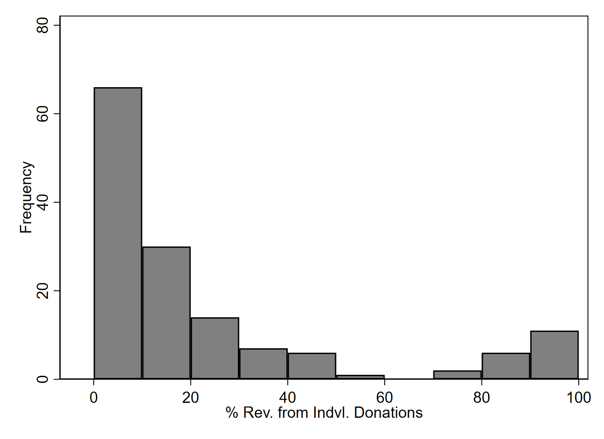
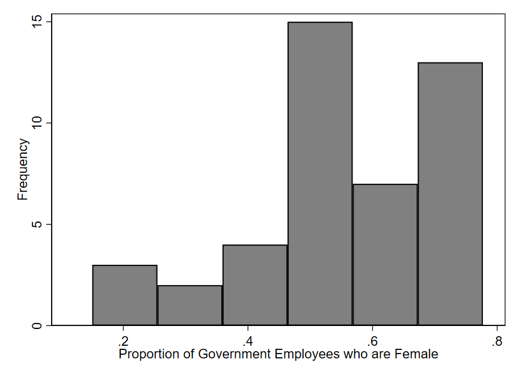
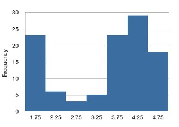
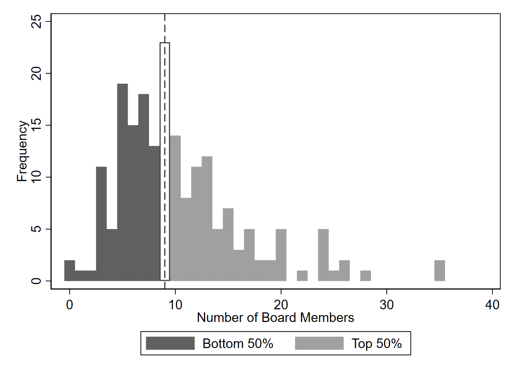
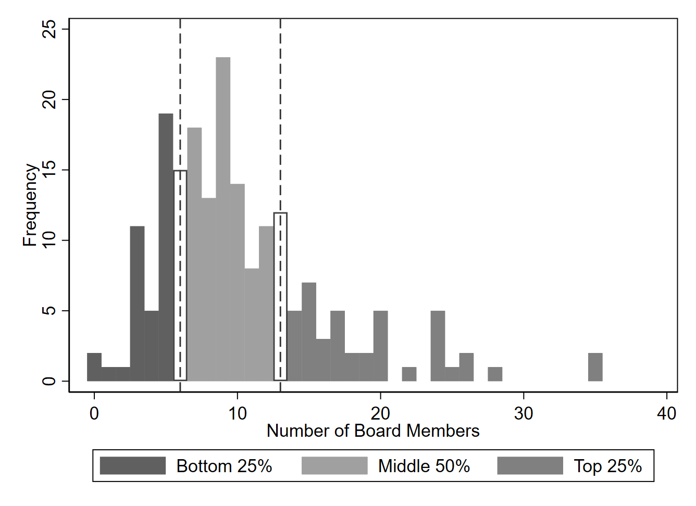
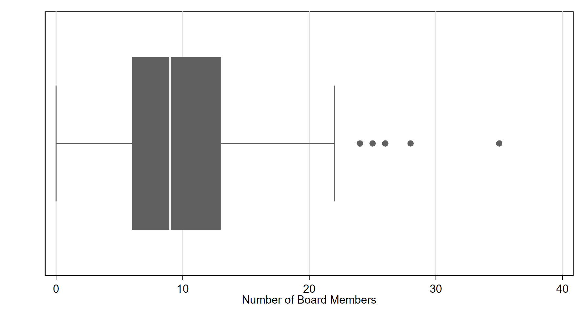
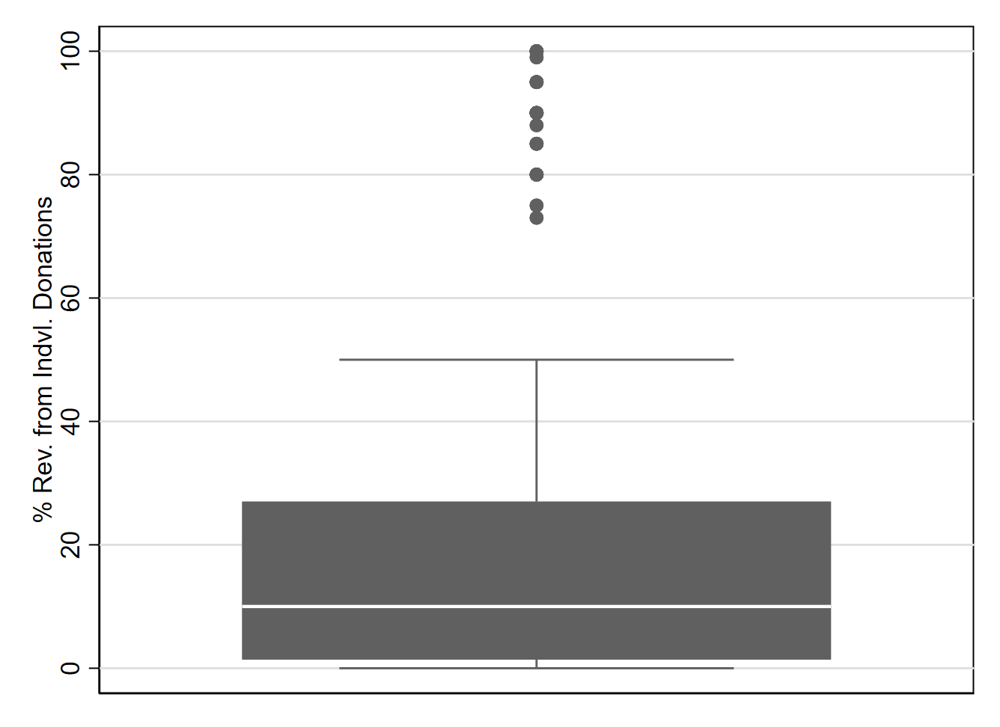
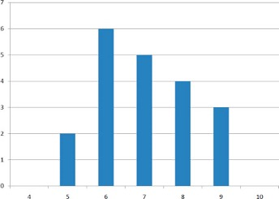
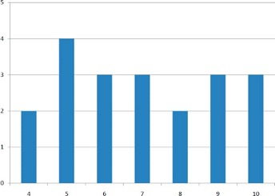
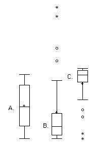

# Describing One Variable at a Time {#sec-describing-one-variable}

\[***Working draft notes for instructors**: This is an early draft of this chapter, and while I expect the basic structure to remain, I am aware that the current examples (including the case study) are underdeveloped. They will be updated shortly (as of June 23, 2026). If you were looking at this in June, note that I have now (as of July 1) move the section on variable transformations to the middle of Ch. 4.*\]

This chapter introduces a variety of concepts and statistics that help us describe one variable at a time. We can describe variables using words, tables, and graphs. The prior chapter already introduced the use of graphs to depict a variable, so this chapter will mainly focus on explaining how to describe variables using words and tables. When we describe a single variable, we typically focus on the **distribution** of the variable. A distribution refers to how frequently all values of a variable occur. For example, if I am examining the binary variable sex in a dataset, the distribution might be 53% female and 47% male. For binary variables it is very easy to succinctly describe the distribution because there are only two possible values. By contrast, quantitative variables sometimes take on many more values than would make sense to list out in a sentence (or even a table), so a variety of terms and statistics have been developed to succinctly summarize the distributions of quantitative variables. As such, most of this chapter will focus on quantitative variables.

After introducing this chapter’s case study, the following sections will introduce key terms for describing a distribution, explain percentiles, describe measures of central tendency, and then cover measures of spread. Finally, the chapter will go over variable transformations, which can be used to change the units in which a variable is expressed.

::: {.callout-tip icon="false"}
## Chapter Case Study: A Survey of Nonprofit Organizations {.unnumbered}

Some researchers wanted to learn about nonprofit organizations, so they created a survey and invited leaders of nonprofits in the U.S. to respond to it. The authors made efforts to ensure the final survey data included responses from a broad range of nonprofit organizations throughout the U.S., making it a particularly high quality source of information about the nonprofit sector. The researchers have made the data publicly available, although they mask certain details in order to anonymize the data (meaning that one should not be able to identify the exact nonprofit being described in a given observation).

There are many variables available in the nonprofit survey dataset, but we will look at only a handful in this chapter. To start, we can get a sense of the types of missions pursued by the nonprofits completing the survey by looking at a 5-category sub-sector variable provided by the researchers.

@tbl-5-nonprofit-subsectors is an example of **frequency table**, which lists all the values a variable takes on and how frequently each one occurs. Based on the frequencies shown, the category with the largest percentage is human services, so we can say that the **mode** of the sub-sector variable is “human services.” Since no category has more than 50%, there is no category that accounts for a majority of observations. Instead, we say that a *plurality* of organizations in this dataset belong to the human services sub-sector, meaning that it is the largest category but is still less than 50%.

| Nonprofit Sub-Sector | Freq. | Percent |
|----------------------|-------|---------|
| Arts                 | 862   | 21.25   |
| Education            | 220   | 5.42    |
| Health               | 302   | 7.45    |
| Human Services       | 1,753 | 43.22   |
| Other                | 919   | 22.66   |
|                      |       |         |
| Total                | 4,056 | 100.00  |

: Frequency Table for Sub-Sector Variable {#tbl-5-nonprofit-subsectors}

How do these nonprofits fund their operations? There are multiple survey questions relevant to this topic, but let’s focus on an item asking about reliance on individual donations. Specifically, the item asks nonprofit leaders to estimate the percent of their revenue that comes from individual donations. @tbl-nonprofits-descriptive-stats displays some typical statistics to describe this variable, alongside two other variables that we will also discuss. As the headings indicate, this table displays (for each variable) the number of observations (after excluding any observations with missing data for this variable), the mean (or average), the standard deviation, the minimum, and the maximum. The row labeled "% Rev. from Indv. Donations" displays these statistics for the individual donations variable. The number of observations is 2,672, which is notably smaller than the values listed for the other two variables, meaning that this variable has more missing values, probably because many respondents skipped answering this question (or perhaps quit the survey altogether before getting to this question). We also see that the nonprofit leaders in this dataset estimate they receive an average of 27% of their revenue from individual donations, though the minimum and maximum values also indicate the existence of organizations receiving no individual donations (0%) and receiving revenue only from individual donations (100%). The standard deviation is a more difficult statistic to interpret, so we will wait to describe it until later in this chapter.

+------------------------------+---------+-----------+------------+---------+----------+
|                              | Obs.    | Mean      | Std. Dev.  | Min     | Max      |
+==============================+=========+===========+============+=========+==========+
| \% Rev. from Indv. Donations | 2672    | 27.0      | 28.7       | 0       | 100      |
+------------------------------+---------+-----------+------------+---------+----------+
| \# of Fulltime Staff         | 3529    | 14.4      | 58.6       | 0       | 1600     |
+------------------------------+---------+-----------+------------+---------+----------+
| \# of People Served          | 3527    | 1,187,561 | 67,354,868 | 0       | 4.00e+09 |
+------------------------------+---------+-----------+------------+---------+----------+

: Descriptive Statistics for Quantitative Variables {#tbl-nonprofits-descriptive-stats}

The next two variables in @tbl-nonprofits-descriptive-stats are related to another feature of organizations that we can consider here: how large these nonprofit organizations are. How exactly shall we measure organizational size? There are many possibilities, but we will focus on three: (1) the number of employees, (2) the number of people served, and (3) how much money the organization spends. The measures available for the first two measures are regular quantitative variables, which is why they appear in @tbl-nonprofits-descriptive-stats. We can see that the average organization has around 14 fulltime staff members, though there are organizations

For the third measure of size (organizational spending levels), the survey researchers have reported this variable only in “bins” (a concept we learned about in the prior chapter in the context of histograms). The researchers likely report the data in this way to protect the privacy of those responding to the survey.\[\^describing-one-variable-1\] This effectively converts what was originally a quantitative variable into an ordinal variable. Ordinal variables can typically be treated as either quantitative or qualitative. For the present discussion, it is simpler to treat this variable as qualitative and show its distribution with a frequency table.

| Revenue                 | Freq. | Percent |
|-------------------------|-------|---------|
| \<\$100,000             | 641   | 15.80   |
| \$100,000-\$499,999     | 1,803 | 44.45   |
| \$500,000-\$999,999     | 648   | 15.98   |
| \$1 million-\$9,999,999 | 861   | 21.23   |
| \$10 million and above  | 103   | 2.54    |
|                         |       |         |
| Total                   | 4,056 | 100.00  |

Throughout this chapter, we will re-examine the variables and statistics shown above to further demonstrate key material for this chapter on describing variables one at a time. Before returning to the main chapter, though, it is worth briefly zooming out and making a few more observations about the big picture of this dataset, drawing on the Three Questions to Always Ask about Data.

2.  **Who (or what) is in the dataset?**

    The researchers conducting this survey provide a detailed description in one of their reports of the types of organizations that were excluded from the study. Particularly notable is the exclusion of very small organizations and many types of religious and educational organizations (such as most churches and schools). These are important things to know about the sample when trying to understand what portions of the nonprofit sector this data is describing.

3.  **How big are the differences?**

    One way to answer this question is to observe how highly varied nonprofit organizations appear to be in terms of size. There are many organizations that are very small and many others that are stunningly large by comparison. This is not a dataset describing a set of organizations with fairly uniform size. Describing the amount of “spread” or lack of uniformity in a variable is not a particularly easy or intuitive thing to do, but we will learn several tools to help us in this chapter.
:::

## Essential Terms and Concepts for Describing Quantitative Variables

Several statistical terms can help us describe in words different characteristics we see in the distributions of quantitative variables. We can get familiar with these terms by looking at several histograms together and then describing their shapes.

@fig-hist-er-cardio shows a histogram for a variable we will examine in more detail in @sec-prob-models. The distribution appears to be fairly **symmetric**: if we divided the graph with a vertical line at the midpoint, the two halves would roughly mirror each other.[^describing-one-variable-1] The peak of the distribution is called the **mode**. Since there is only one well-defined peak, we say that this distribution is **unimodal**. At each end of the graph (left and right), we see some fairly short bars that we refer to as the **tails** of the distribution.

[^describing-one-variable-1]: [World Development Indicators](https://datacatalog.worldbank.org/search/dataset/0037712/world-development-indicators) ([CC-BY 4.0](https://datacatalog.worldbank.org/public-licenses?fragment=cc))

 ([CC-BY 4.0](https://creativecommons.org/licenses/by/4.0/))](Images/describing-one-variable/hist-er-cardio.png){#fig-hist-er-cardio width="400"}

Our next histogram (@fig-hist-donations) depicts the variable measuring revenue from individual donations from our case study. This variable arguably has a unimodal distribution, since there is only one really well-defined peak (although one could argue that the right-most bar indicates a second, much smaller peak). However, this one is not symmetric. Instead, it is **skewed**. Specifically, it is **skewed right** because there is a long tail extending out to the right. The values far out in the tail are often referred to as **outliers**. Outliers refer to unusually small or large values in a distribution. Outliers can also be called *extreme values*. Note too that right skew can also be referred to as **positive skew**.

{#fig-hist-donations width="400"}

@fig-hist-females_publ-2 (seen once already in the previous chapter) shows an example of **left skew**, also known as **negative skew**. Notice that there is a tail extending out to the left side of the graph (and toward the negative side of the number line), but no similar tail exists on the right.

{#fig-hist-females_publ-2 width="400"}

As one final example for this section, consider @fig-eruptionfreqs, which is a **bimodal** distribution, since there are two clear peaks apparent in the histogram. It is also possible to have more than two peaks, so we can generally refer to any distribution with more than one well-defined peak as **multimodal**.

{#fig-eruptionfreqs width="400"}

## Percentiles and Box Plots {#sec-percentiles-and-box-plots}

Percentiles are a powerful tool for describing a distribution. They are commonly used to help interpret standardized exam scores (e.g., university admissions exams). For example, you may have been told that you received a 139 on an exam and that this score indicates the 81st percentile, meaning you scored as good or better than 81% of people taking the exam.

We can further illustrate percentiles using the board size variable from this chapter's case study. As we apply percentiles, we can think of dividing a dataset in two. @fig-hist-board-p50 demonstrates this, using the 50th percentile to divide the observed values of board size into the bottom 50% and the top 50%. Each bar in this graph represents a single value, which is feasible because there are only whole numbers for this variable (you can't have half a board member). The 50th percentile is 9 here, marked with a dashed line in the figure. 50% of these education nonprofits have boards that are 9 members or smaller. The relatively small boards with fewer than 9 members are shown with the bars drawn in a darker shade and labeled “Bottom 50%” in the legend at the bottom of @fig-hist-board-p50. The “Top 50%,” represented by bars in lighter shade, are larger than 9 members. Note that there are also some nonprofit boards with exactly 9 members, which are depicted with a white bar (with grey outline) because some (but not all) of these observations would be needed to get up to exactly 50% when delineating the bottom 50% or the top 50%. Because of these observation's somewhat ambiguous status (being exactly equal to the 50th percentile), they are not shown in either dark or light shading.

{#fig-hist-board-p50 width="400"}

By using multiple percentiles simultaneously, we can divide a variable into more than two “buckets.” For example, we can divide this same variable into 3 buckets: the bottom 25%, the middle 50%, and the top 25%. This division is shown in @fig-hist-board-p25-p75. The divisions between “buckets” are marked with dashed lines, and each bucket uses different shading for the histogram’s bars.

{#fig-hist-board-p25-p75 width="400"}

Using the terminology of percentiles, we can say that the 25th percentile for this variable is 6, as indicated by the dashed line on the left. We can interpret this percentile as indicating that 25% of the boards have a size of 6 members or less. To mark the top 25% of the data, we use the 75th percentile, which is 13 for this variable. Thus, 75% of the education nonprofits in this dataset have boards with 13 or more members.

Box plots are a common way to visualize the percentiles we just discussed for a variable. @fig-boxplot-board shows a box plot for the board size variable. In a box plot, the edges of a rectangle depict the 25th and 75th percentiles. This corresponds exactly to the dashed lines we saw in the prior figure (@fig-hist-board-p25-p75). A line within the box also marks the 50th percentile.

{#fig-boxplot-board width="400"}

“Whiskers” extend out from the sides of the box to show the minimum and maximum values for the variable. Based on where the whiskers end, we can say that the smallest boards have 0 members while the largest have 22. However, 22 is not the true maximum. Notice the dots on the right side of the graph. These indicate outliers, which are often ignored for purposes of defining the minimum and maximum values when drawing the whiskers. Typically (though not always), outliers beyond the range of the whiskers are depicted using dots, as in this example. Various algorithms can be used to determine what exactly counts as an outlier, and most software will use one of these algorithms by default when creating a box plot.

Previously, while examining a histogram of this same variable, we noted that it is right-skewed. We can also see that here, based on the right-side whisker being somewhat longer than the left-side whisker, as well as the presence of outliers on the right side of the graph.

### Defining percentiles

Now that we have seen some visualizations of percentiles, let’s define them a bit more precisely. The key thing to remember is this: *p*% of the data falls (at or) below the *p*th percentile. Thus, the *p*th percentile is a value indicating the point at which *p*% of the data is less than or equal to this value. *p* can be any number between 0 and 100. For example, if the 22nd percentile of a variable is 5, then 22% of the variable’s observations are less than or equal to 5. The flip side of this is that 78% of the variable’s observation must be greater than or equal to 5. Any percentile can be understood as marking a dividing line in a dataset, with *p*% of the data to the left and (100 - *p*)% to the right.

To find the *p*th percentile, we can line all the observations for a variable from least to greatest and then pick the value that marks the *p*% point in this lineup (e.g, for 50th percentile, pick the middle point). In practice, this process can get a bit complicated because we need rules to deal with ties, rounding, etc. There are, in fact, conflicting definitions of percentiles that employ different rules for such situations. If you are curious to learn more, this chapter contains an appendix with further details (Appendix I). Fortunately, these details are not essential for making use of percentiles to describe distributions. For the purposes of an introductory text, we can simply assume that software will make the exact computations needed to find percentiles under a widely-used definition. Slight differences in methods for computing percentiles will not usually affect our conclusions, at least if we are working with a large dataset where there are not large gaps in the values observed. Percentiles may be less useful/well-defined for describing datasets with very few observations (e.g., less than 50) or variables that take on only a small number of different values (e.g., only small whole numbers).

### Box plots and five number summaries

As one additional example of a box plot, let’s examine the individual donations variable from this chapter’s case study. @fig-box-donations contains a box plot for this variable, and unlike the other box plots we’ve seen so far, this one has been drawn vertically. As we noted in an earlier section when examining a histogram, this variable is right-skewed, which we now see in the form of the long whisker and outliers at the top of the graph, since it is now the top of the graph that shows the highest values. There are dots depicting outliers, but they appear to be quite dense, sometimes overlapping and perhaps even stacking on top of one another. In cases like this, we can consider plotting the outliers in another way, such as using open circles and perhaps spreading them out a bit by adding some random “jitter” to their locations (as in the strip plot shown in the prior chapter).

{#fig-box-donations width="400"}

You will likely encounter box plots that look quite different from the ones displayed in this chapter. While every box plot should start from drawing a box and whiskers, formating varies and extra features can be added to the plot. For example, people sometimes add a marking (such as an "X") to indicate the mean for the variable. Sometimes it will also be the case that so many observations take on the same value that the minimum and the 25th percentile are the same, for example. This leads to a rather funny looking box plot since the whisker has a length of 0, meaning it essentially stacks on top of the edge of the box. If you try making your own box plots with software, you may encounter issues like this that make some box plots look very different from what you expected.

One common way of using percentiles to succinctly describe a distribution in table format is with a “five number summary.” This refers to the 0th, 25th, 50th, 75th, and 100th percentiles. In fact, that is exactly what a box plot shows, except that outliers are often omitted when drawing the whiskers in such plots. @tbl-five-number-summary shows an alternative to the descriptive statistics table from this chapter’s case study, using the five number summary.

+------------------------------+-----------+---------+---------+---------+-------------+
|                              | Min. (p0) | p25     | p50     | p75     | Max. (p100) |
+==============================+===========+=========+=========+=========+=============+
| \% Rev. from Indv. Donations | 0         | 5       | 15      | 40      | 100         |
+------------------------------+-----------+---------+---------+---------+-------------+
| \# of Fulltime Staff         | 0         | 1       | 3       | 10      | 1600        |
+------------------------------+-----------+---------+---------+---------+-------------+
| \# of People Served          | 0         | 329     | 1,500   | 7,000   | 4.00e+09    |
+------------------------------+-----------+---------+---------+---------+-------------+

: Five Number Summary for Quantitative Variables from Chapter Case Study {#tbl-five-number-summary}

To conclude this section, I highlight some interchangeable terminology that is important to know in the context of percentiles:

-   The 0th percentile is the same as the **minimum**, or the smallest value observed for a variable.

-   The 100th percentile is the same as the **maximum**, or the largest value observed for a variable.

-   The 50th percentile is also called the **median**, as we will discuss in further detail in the following section.

-   The five number summary suggest a division of the data into four “buckets.” These four buckets are known as **quartiles**.

## Measures of Central Tendency

With measures of central tendency, we seek to identify a single number that helps answer the question “What is the typical value for this variable?”

The most common measure of central tendency is the **mean**, which is what we typically mean when we say the “average.” To calculate the mean, we simply add up all the values appearing for a variable and then divide by the number of observations.

A common alternative to the mean is the **median**. As noted in the prior section, the median is also the 50th percentile. To identify the median, we can line up all observations from least to greatest (according to the variable of interest) and then pick the value in the very middle. If two values are tied (i.e., there is an even number of observations), we take the average of the two tied values.

A third measure of central tendency is the **mode**. This is the value that occurs most often.

How do we choose among these three measures of central tendency? The ideal measure usually depends on the data and the purpose of the analysis.

For qualitative data, only the mode is available. There is no way to calculate a mean or median for a qualitative variable (although people sometimes accidentally do so if they have used numbers to code the variable within a spreadsheet).

For quantitative variables, the mode is sometimes a reasonable option but not always. It largely depends on the specific type of quantitative variable. *Continuous* variables are reported to many digits (usually with decimal places), so it is rare to see the same value repeating very often if at all. As such, the mode is a poor measure of central tendency for continuous variables. For *discrete* variables, which typically take on whole numbers, the mode can be more appropriate. For example, the mode is a perfectly reasonable measure of central tendency for a variable measuring the number of people in a household.

There is still a way to make use of the mode for continuous variables. It requires using “bins,” as we do whenever we create a histogram. When we refer to the peak or tallest bar in a histogram as the mode, we are identifying the bin with the range of values that occur most often.

If we are examining a quantitative variable and do not want outliers to have too much influence on our measure of central tendency, then the median is often the preferred option. This is because mean is highly sensitive to outliers, while the median is not. Consider the quantitative measures of organizational size from this chapter's case study. The values of the mean shown in our initial descriptive statistics table turn out to be rather poor summaries of these variables for most purposes. This is especially true for the variable indicating the number of people served, where an extreme outlier hugely influences the mean: one organization indicates that it has served 2 billion people. The contrast between the median (percentile) based description in @tbl-five-number-summary and the original descriptive table (@tbl-nonprofits-descriptive-stats) is stark for this variable, as well as the variable indicating number of employees.

For variables where there are no big outliers or where the distribution is symmetric (and thus the outliers are balanced between the left and right tails), the mean and the median usually yield similar values. In right-skewed distributions, the mean is typically larger (to the “right” of) the median. This matches the description provided above for the quantitative size variables from our case study. For left-skewed distributions, the mean is typically to the left of the median.

Given concerns about outliers, you will find that the median is often used to describe variables like income or size that may be highly right-skewed.

Sometimes, however, the mean’s sensitivity to outliers is a strength. If we are trying to run a business and need to make sure that subscription revenues for a maintenance will cover the costs, we will probably want to compare average revenue per subscriber to average costs. If one in every 100 subscribers requires help that costs many multiples of the ordinary subscriber, we will need to price the subscription to cover these “outlier” expenses. Relying on median costs to set the price of subscriptions could yield disastrous results, since the outliers cases could cost so much that they wipe out our earnings from all the typical customers.

The mean is also often an attractive option when summarizing certain ordinal variables, like those commonly resulting from use of Likert scales. Such variables will not have large outliers, and the median will often not respond to relatively subtle but potentially important differences in response pattern. For example, suppose employees from two different companies respond to a survey where they respond to a question asking how satisfied they are at work. If 90% of respondents in company A select “very satisfied” (the top response option) while only 60% select “very satisfied” in company B, median satisfaction for both companies will be the same, but the mean will be higher in company A.

Given that both the mean and the median have clear advantages and clear drawbacks, some sources recommend reporting both statistics whenever describing the central tendency of a variable. This is probably a good rule of thumb to start from, and with experience you can figure out when one statistics or the other is more useful depending on the data and the broader context of your analysis.

## Measures of Spread[^describing-one-variable-2]

[^describing-one-variable-2]: The first pargraph and initial graphs in this section are adapted from David M. Lane. “Measures of Variability.” *Online Statistics Education: A Multimedia Course of Study*. <https://onlinestatbook.com/2/summarizing_distributions/variability.html>

Spread refers to how "spread out" a group of scores is. To see what we mean by spread out, consider @fig-quiz-1 and @fig-quiz-2. These graphs represent the scores on two quizzes. The mean score for each quiz is 7.0. Despite the equality of means, you can see that the distributions are quite different. Specifically, the scores on Quiz 1 are more densely packed and those on Quiz 2 are more spread out. The differences among students were much greater on Quiz 2 than on Quiz 1.

{#fig-quiz-1 width="425"}

{#fig-quiz-2 width="425"}

Measures of spread help us answer the question “How tightly is the data clustered around the center of the distribution?” Or if we wish to more specifically reference a measure of central tendency, we might ask “Are most observed values for this variable pretty close to its mean/median?”

The simplest measure of central tendency is the **range**. The range is the difference between a variable’s minimum and maximum value. Sometimes it is expressed as a single number (e.g., if the minimum is 100 and the maximum is 300, the range is 200 since 300 - 100 = 200). Other times, it is described as the interval defined by the minimum and maximum (e.g., 100 to 300). While the range has the benefit of being simple and intuitive, it is sensitive to outliers and tells us little about whether the typical value lies close to the mean/median.

One should also exercise great caution in using the range to make comparisons. The range can be sensitive to sample size: a larger sample offers greater opportunity for the range to expand. If one is comparing males to females and has equally-sized samples for each sex, comparing the range among female for some variable to its range among men may be reasonable. However, if we were to compare two samples with different numbers of observations, then the range is not necessarily a good way to compare the spreads of the samples.

Another measure of spread is the **interquartile range (IQR)**, which refers to the difference between the 75th and 25th percentile. The IQR is depicted as the length of the “box” when we draw a box plot. When the IQR is larger, it indicates that the middle 50% of the data is spread out over a larger range of values.

The most common measures of spread are **variance** and **standard deviation**. The formula for variance is provided in Appendix II. It is based on observing how far each and every value is from the average value. If the mean is 52 and most observations are very close to this average (e.g., most observations are in the range of 51 to 53), the variance will be quite small. If many observations have values that are quite far from the average (e.g., many observations are as low as in the 20s and and high as in the 80s), the variance will be quite large. To be precise, the calculation of variance is based on finding the average squared distance between each observation and the mean.

Standard deviation is closely related to variance: you simply take the square root of the variance to find the standard deviation. Since variance is based on squared distance from the mean, taking the square root at the end gets us back to our original units in some sense. Therefore, we can interpret the standard deviation of X as approximating the typical distance between a given value of X and the mean of X. For example, suppose I tell you about a prison where the prisoners have a mean age of 42 years with a standard deviation of 8 years. If I randomly select one prisoner and ask you to guess their age, you should probably guess 42 since I’ve told you that is the mean. But even though 42 is your best guess, you can expect your guess to be off by about 8 years since the standard deviation is 8 (meaning the typical distance between a random prisoner’s age and the mean age is approximately 8). You can’t say ahead of time which direction your guess is likely to be off (guessing too old versus too young), just that you are likely to miss the reality for a randomly-selected individual by about 8 years on a typical guess (though any one guess may happen to be closer or further than 8 years).

The concept of spread can also be referred to as *variability* or *dispersion*. We can also say that large spread indicates high **heterogeneity**, meaning that units tend not to closely resemble one another. On the flip side, a small spread indicates that for the variable being examined, observations are highly **homogeneous** or highly uniform.

## Exercises[^describing-one-variable-3]

[^describing-one-variable-3]: More specifically, the arithmetic mean is the most common measure of central tendency. Although the arithmetic mean is not the only "mean" (there is also a geometric mean), it is by far the most commonly used. Therefore, if the term "mean" is used without specifying whether it is the arithmetic mean, the geometric mean, or some other mean, it is assumed to refer to the arithmetic mean.

1.  Find the mean and median for the following three variables:

    | A   | B   | C   |
    |-----|-----|-----|
    | 8   | 4   | 6   |
    | 5   | 4   | 2   |
    | 7   | 6   | 3   |
    | 1   | 3   | 4   |
    | 3   | 4   | 1   |

2.  You recorded the time in seconds it took for 8 participants to solve a puzzle. These times appear below. However, when the data was entered into the statistical program, the score that was supposed to be 22.1 was entered as 21.2. You had calculated the following measures of central tendency: the mean and the median. Which of these measures of central tendency will change when you correct the recording error?

    15.2\
    18.8\
    19.3\
    19.7\
    20.2\
    21.8\
    22.1\
    29.4

3.  For the scores in the prior question, which measures of variability (range, standard deviation, variance) would be changed if the 22.1 data point had been erroneously recorded as 21.2?

4.  You know the minimum, the maximum, and the 25th, 50th, and 75th percentiles of a distribution. Which of the following measures of central tendency or variability can you determine? mean, median, mode, range, interquartile range, variance, standard deviation

5.  A sample of 30 distance scores measured in yards has a mean of 7, a variance of 16, and a standard deviation of 4. (a) You want to convert all your distances from yards to feet, so you multiply each score in the sample by 3. What are the new mean, variance, and standard deviation? (b) You then decide that you only want to look at the distance past a certain point. Thus, after multiplying the original scores by 3, you decide to subtract 4 feet from each of the scores. Now what are the new mean, variance, and standard deviation?

6.  Your younger brother comes home one day after taking a science test. He says that someone at school told him that "60% of the students in the class scored above the median test grade." What is wrong with this statement? What if he said "60% of the students scored below the mean?"

7.  If the mean time to respond to a stimulus is much higher than the median time to respond, what can you say about the shape of the distribution of response times?

8.  An experiment compared the ability of three groups of participants to remember briefly-presented chess positions. The data are shown below. The numbers represent the total number of pieces correctly remembered from three chess positions. Create side-by-side box plots for these three groups. What can you say about the differences between these groups from the box plots?

    | Non-players | Beginners | Tournament players |
    |-------------|-----------|--------------------|
    | 22.1        | 32.5      | 40.1               |
    | 22.3        | 37.1      | 45.6               |
    | 26.2        | 39.1      | 51.2               |
    | 29.6        | 40.5      | 56.4               |
    | 31.7        | 45.5      | 58.1               |
    | 33.5        | 51.3      | 71.1               |
    | 38.9        | 52.6      | 74.9               |
    | 39.7        | 55.7      | 75.9               |
    | 43.2        | 55.9      | 80.3               |
    | 43.2        | 57.7      | 85.3               |

9.  In a box plot, what percent of the scores are between the lower and upper hinges?

10. Which of the box plots in @fig-boxplots-exercises has a large positive skew? Which has a large negative skew?

    {#fig-boxplots-exercises width="170"}

11. When is a log transformation valuable?

## @sec-describing-one-variable Appendix I: Calculating Percentiles[^describing-one-variable-4] {.unnumbered}

[^describing-one-variable-4]: This section is adapted from David M. Lane. “Percentiles.” *Online Statistics Education: A Multimedia Course of Study*. <https://onlinestatbook.com/2/introduction/percentiles.html>

There is no universally accepted definition of a percentile. Using the 65th percentile as an example, the 65th percentile can be defined as the lowest score that is greater than 65% of the scores. We will call this "Definition 1." The 65th percentile can also be defined as the smallest score that is greater than *or equal to* 65% of the scores. This we will call "Definition 2." Though these two definitions appear very similar, they can sometimes lead to dramatically different results, especially when there is relatively little data. Moreover, neither of these definitions is explicit about how to handle rounding. For instance, what rank is required to be higher than 65% of the scores when the total number of scores is 50? This is tricky because 65% of 50 is 32.5. How do we find the lowest number that is higher than 32.5 of the scores?

A third way to compute percentiles is a weighted average of the percentiles computed according to the first two definitions. The details of computing percentiles under this third definition are a bit complicated. Let's begin with an example. Consider the 25th percentile for the 8 numbers in @tbl-numberrankscores. Notice the numbers are given ranks ranging from 1 for the lowest number to 8 for the highest number.

+-------+------------+-------+----------+-------+
|       | **Number** |       | **Rank** |       |
+=======+============+=======+==========+=======+
|       | 3\         |       | 1\       |       |
|       | 5\         |       | 2\       |       |
|       | 7\         |       | 3\       |       |
|       | 8\         |       | 4\       |       |
|       | 9\         |       | 5\       |       |
|       | 11\        |       | 6\       |       |
|       | 13\        |       | 7\       |       |
|       | 15         |       | 8        |       |
+-------+------------+-------+----------+-------+

: Test Scores. {#tbl-numberrankscores}

The first step is to compute the rank ($R$) of the 25th percentile. This is done using the following formula:

$$
R = P/100 \times (N + 1)
$$

where $P$ is the desired percentile (25 in this case) and $N$ is the number of numbers (8 in this case). Therefore,

$$
R = 25/100 \times (8 + 1) = 9/4 = 2.25.
$$

If $R$ is an integer, the $Pth$ percentile is the number with rank $R$. When $R$ is not an integer, we compute the $Pth$ percentile by interpolation as follows:

1.  Define $IR$ as the integer portion of $R$ (the number to the left of the decimal point). For this example, $IR$ = 2.

2.  Define $FR$ as the fractional portion of $R$. For this example, $FR$ = 0.25.

3.  Find the scores with Rank $IR$ and with Rank $IR$ + 1. For this example, this means the score with Rank 2 and the score with Rank 3. The scores are 5 and 7.

4.  Interpolate by multiplying the difference between the scores by $FR$ and add the result to the lower score. For these data, this is (0.25)(7 - 5) + 5 = 5.5.

Therefore, the 25th percentile is 5.5. If we had used the first definition (the smallest score greater than 25% of the scores), the 25th percentile would have been 7. If we had used the second definition (the smallest score greater than or equal to 25% of the scores), the 25th percentile would have been 5.

For a second example, consider the 20 quiz scores shown in @tbl-quizscores.

+-------+-----------+-------+----------+-------+
|       | **Score** |       | **Rank** |       |
+=======+===========+=======+==========+=======+
|       | 4\        |       | 1\       |       |
|       | 4\        |       | 2\       |       |
|       | 5\        |       | 3\       |       |
|       | 5\        |       | 4\       |       |
|       | 5\        |       | 5\       |       |
|       | 5\        |       | 6\       |       |
|       | 6\        |       | 7\       |       |
|       | 6\        |       | 8\       |       |
|       | 6\        |       | 9\       |       |
|       | 7\        |       | 10\      |       |
|       | 7\        |       | 11\      |       |
|       | 7\        |       | 12\      |       |
|       | 8\        |       | 13\      |       |
|       | 8\        |       | 14\      |       |
|       | 9\        |       | 15\      |       |
|       | 9\        |       | 16\      |       |
|       | 9\        |       | 17\      |       |
|       | 10\       |       | 18\      |       |
|       | 10\       |       | 19\      |       |
|       | 10        |       | 20       |       |
+-------+-----------+-------+----------+-------+

: 20 quiz scores. {#tbl-quizscores}

We will compute the 25th and the 85th percentiles. For the 25th,

$$
R = 25/100 \times (20 + 1) = 21/4 = 5.25.
$$

$$
IR = 5 \text{ and } FR = 0.25.
$$

Since the score with a rank of $IR$ (which is 5) and the score with a rank of $IR$ + 1 (which is 6) are both equal to 5, the 25th percentile is 5. In terms of the formula:

$$
 \text{ 25th percentile } = (.25) \times (5 - 5) + 5 = 5.
$$

For the 85th percentile,

$$
R = 85/100 \times (20 + 1) = 17.85.
$$

$$
IR = 17 \text{ and } FR = 0.85
$$

> Caution: $FR$ does not generally equal the percentile to be computed as it does here.

The score with a rank of 17 is 9 and the score with a rank of 18 is 10. Therefore, the 85th percentile is:

$$
(0.85)(10 - 9) + 9 = 9.85
$$

Consider the 50th percentile of the numbers 2, 3, 5, 9.

$$
R = 50/100 \times (4 + 1) = 2.5.
$$

$$
IR = 2 \text{ and } FR = 0.5.
$$

The score with a rank of $IR$ is 3 and the score with a rank of $IR$ + 1 is 5. Therefore, the 50th percentile is:

$$
(0.5)(5 - 3) + 3 = 4.
$$

Finally, consider the 50th percentile of the numbers 2, 3, 5, 9, 11.

$$
R = 50/100 \times (5 + 1) = 3.
$$

$$
IR = 3 \text{ and } FR = 0.
$$

Whenever $FR$ = 0, you simply find the number with rank $IR$. In this case, the third number is equal to 5, so the 50th percentile is 5. You will also get the right answer if you apply the general formula:

$$
 \text{ 50th percentile }= (0.00) (9 - 5) + 5 = 5.
$$

## @sec-describing-one-variable Appendix II: Formulas for Calculating Key Descriptive Statistics

### Mean[^describing-one-variable-5] {.unnumbered}

[^describing-one-variable-5]: This section is adapted from David M. Lane. “Measures of Central Tendency.” *Online Statistics Education: A Multimedia Course of Study*. <https://onlinestatbook.com/2/summarizing_distributions/measures.html>

The mean[^describing-one-variable-6] is simply the sum of the numbers divided by the number of numbers. When using symbols and formulas to represent different statistics, we often distinguish between whether we are looking at a “sample” or a “population.” We’ll cover this distinction in more detail in @sec-stat-inference. For now, think of a pollster who has conducted a survey with a sample of 1000 people. Even though only 1000 people responded to the survey, the pollster is actually interested in estimating the attitudes of a larger population—the entire public.

[^describing-one-variable-6]: More specifically, the arithmetic mean is the most common measure of central tendency. Although the arithmetic mean is not the only "mean" (there is also a geometric mean), it is by far the most commonly used. Therefore, if the term "mean" is used without specifying whether it is the arithmetic mean, the geometric mean, or some other mean, it is assumed to refer to the arithmetic mean.

The symbol $\mu$ is used for the mean of a population. The symbol $\bar{x}$ is used for the mean of a sample. The formula for $\mu$ is shown below:

$$
\mu = \frac{\sum_{i=1}^{N} x_i}{N}
$$

where $\sum_{i=1}^{N} x_i$ is the sum of all the numbers in the population and $N$ is the number of numbers in the population. Note that the summation syntax $\sum_{i=1}^{N}$ indicates that we begin at $i=1$ and repeatedly increase the value of our counter $i$ by 1 until we get to $N$. Each time, we take $x_i$, which refers to the $i$th observation of the variable $x$, and that is the value we add to the running list of values to sum.

The formula for $\bar{x}$ is essentially identical:

$$
\bar{x} = \frac{\sum_{i=1}^{n} x_i}{n}
$$

where $\sum_{i=1}^{n} x_i$ is the sum of all the numbers in the sample and $n$ is the number of numbers in the sample.

As an example, the mean of the numbers 1, 2, 3, 6, 8 is 20/5 = 4 regardless of whether the numbers constitute the entire population or just a sample from the population.

@tbl-tdownpasses shows the number of touchdown (TD) passes thrown by each of the 31 teams in the National Football League in the 2000 season. The mean number of touchdown passes thrown is 20.4516 as shown below.

$$
\mu = \frac{\sum_{i=1}^{N} x_i}{N} = \frac{634}{31} = 20.4516
$$

+-------------+--------------------------------------------------------------------------------------------+-------------+
|             | 37 33 33 32 29 28 28 23 22 22 22 21 21 21 20 20 19 19 18 18 18 18 16 15 14 14 14 12 12 9 6 |             |
+-------------+--------------------------------------------------------------------------------------------+-------------+

: Number of touchdown passes. {#tbl-tdownpasses}

### Variance[^describing-one-variable-7] {.unnumbered}

[^describing-one-variable-7]: This section is adapted from David M. Lane. “Measures of Variability.” *Online Statistics Education: A Multimedia Course of Study*. <https://onlinestatbook.com/2/summarizing_distributions/variability.html>

Using the mean as the measure of the middle of the distribution, the variance is defined as the average squared difference of the scores from the mean. The data from Quiz 1 are shown in @tbl-quiz1var. The mean score is 7.0. Therefore, the column "Deviation from Mean" contains the score minus 7. The column "Squared Deviation" is simply the previous column squared.

+--------+------------+--------+-------------------------+--------+-----------------------+--------+
|        | **Scores** |        | **Deviation from Mean** |        | **Squared Deviation** |        |
+========+============+========+=========================+========+=======================+========+
|        | 9          |        | 2                       |        | 4                     |        |
+--------+------------+--------+-------------------------+--------+-----------------------+--------+
|        | 9          |        | 2                       |        | 4                     |        |
+--------+------------+--------+-------------------------+--------+-----------------------+--------+
|        | 9          |        | 2                       |        | 4                     |        |
+--------+------------+--------+-------------------------+--------+-----------------------+--------+
|        | 8          |        | 1                       |        | 1                     |        |
+--------+------------+--------+-------------------------+--------+-----------------------+--------+
|        | 8          |        | 1                       |        | 1                     |        |
+--------+------------+--------+-------------------------+--------+-----------------------+--------+
|        | 8          |        | 1                       |        | 1                     |        |
+--------+------------+--------+-------------------------+--------+-----------------------+--------+
|        | 8          |        | 1                       |        | 1                     |        |
+--------+------------+--------+-------------------------+--------+-----------------------+--------+
|        | 7          |        | 0                       |        | 0                     |        |
+--------+------------+--------+-------------------------+--------+-----------------------+--------+
|        | 7          |        | 0                       |        | 0                     |        |
+--------+------------+--------+-------------------------+--------+-----------------------+--------+
|        | 7          |        | 0                       |        | 0                     |        |
+--------+------------+--------+-------------------------+--------+-----------------------+--------+
|        | 7          |        | 0                       |        | 0                     |        |
+--------+------------+--------+-------------------------+--------+-----------------------+--------+
|        | 7          |        | 0                       |        | 0                     |        |
+--------+------------+--------+-------------------------+--------+-----------------------+--------+
|        | 6          |        | -1                      |        | 1                     |        |
+--------+------------+--------+-------------------------+--------+-----------------------+--------+
|        | 6          |        | -1                      |        | 1                     |        |
+--------+------------+--------+-------------------------+--------+-----------------------+--------+
|        | 6          |        | -1                      |        | 1                     |        |
+--------+------------+--------+-------------------------+--------+-----------------------+--------+
|        | 6          |        | -1                      |        | 1                     |        |
+--------+------------+--------+-------------------------+--------+-----------------------+--------+
|        | 6          |        | -1                      |        | 1                     |        |
+--------+------------+--------+-------------------------+--------+-----------------------+--------+
|        | 6          |        | -1                      |        | 1                     |        |
+--------+------------+--------+-------------------------+--------+-----------------------+--------+
|        | 5          |        | -2                      |        | 4                     |        |
+--------+------------+--------+-------------------------+--------+-----------------------+--------+
|        | 5          |        | -2                      |        | 4                     |        |
+--------+------------+--------+-------------------------+--------+-----------------------+--------+
|        |            |        | **Means**               |        |                       |        |
+--------+------------+--------+-------------------------+--------+-----------------------+--------+
|        | 7          |        | 0                       |        | 1.5                   |        |
+--------+------------+--------+-------------------------+--------+-----------------------+--------+

: Calculation of Variance for Quiz 1 scores. {#tbl-quiz1var}

One thing that is important to notice is that the mean deviation from the mean is 0. This will always be the case. The mean of the squared deviations is 1.5. Therefore, the variance is 1.5. Analogous calculations with Quiz 2 show that its variance is 6.7. The formula for the variance is:

$$
\sigma^2=\frac{\sum_{i=1}^{N} (x_i-\mu)^2}{N}
$$

where $\sigma^2$ is the variance, $\mu$ is the mean, and $N$ is the number of numbers. For Quiz 1, $\mu$ = 7 and $N$ = 20.

If the variance in a sample is used to estimate the variance in a population, then the previous formula underestimates the variance and the following formula should be used:

$$
s^2=\frac{\sum_{i=1}^{n}(x_i-\bar{x})^2}{n-1}
$$

where $s^2$ is the estimate of the variance and $\bar{x}$ is the sample mean.

Note that $\bar{x}$ is the mean of a sample taken from a population with a mean of $\mu$. Since, in practice, the variance is usually computed in a sample, this formula is most often used. While it is not easy to succinctly explain why we divide by $n-1$ rather than simply $n$, the simulation "estimating variance"[^describing-one-variable-8] illustrates the bias that arises if we use $n$ as the denominator in the formula.

[^describing-one-variable-8]: <https://onlinestatbook.com/2/summarizing_distributions/variance_est.html>

Let's look at a concrete example of calculating the sample variance. Assume the scores 1, 2, 4, and 5 were sampled from a larger population. To estimate the variance in the population you would compute $s^2$ as follows:

$$
\bar{x} = (1 + 2 + 4 + 5)/4 = 12/4 = 3
$$

$$
s^2 = [(1-3)^2 + (2-3)^2 + (4-3)^2 + (5-3)^2]/(4-1)
$$$$
= (4 + 1 + 1 + 4)/3 = 10/3 = 3.333
$$

As noted in the main text, the standard deviation is simply the square root of the variance. This makes the standard deviations of the two quiz distributions 1.225 and 2.588.
