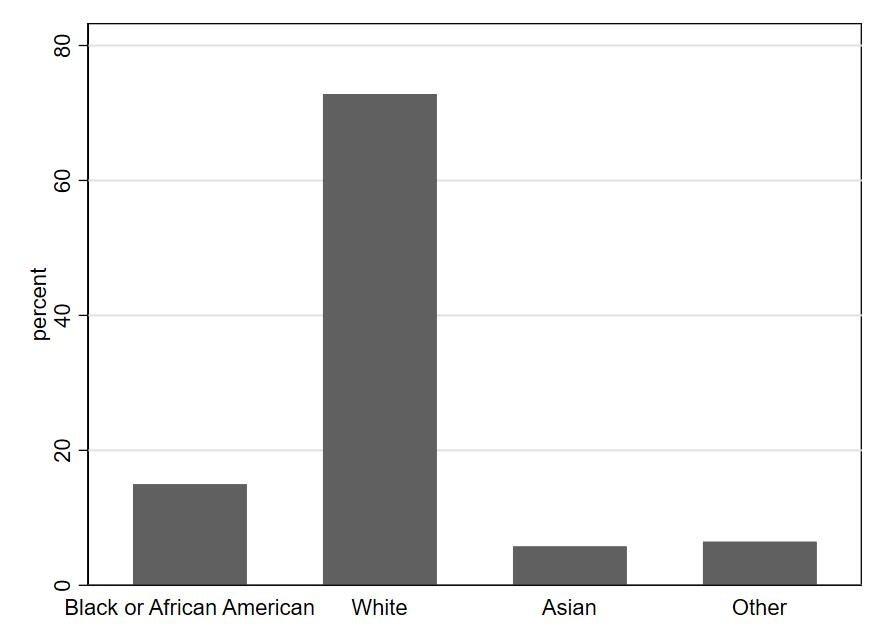
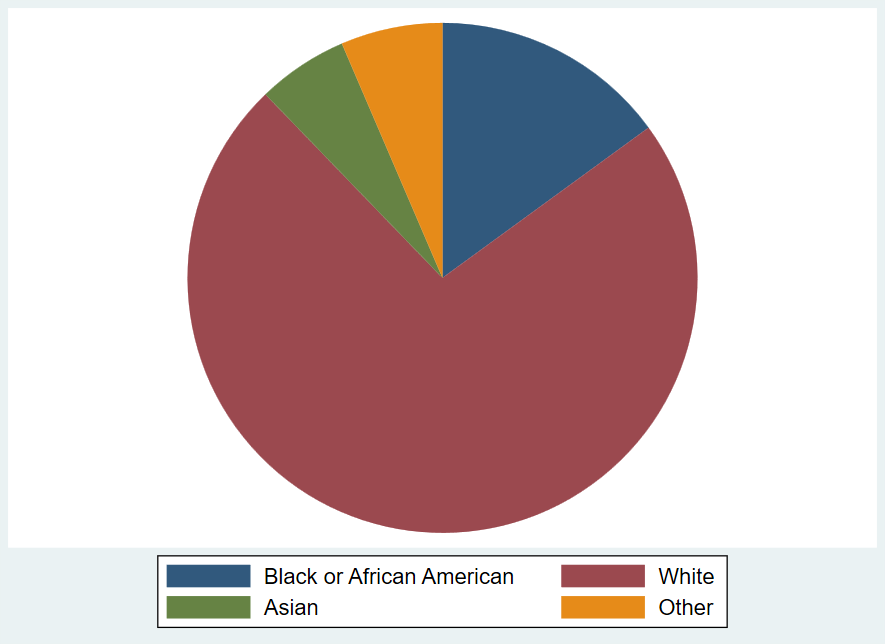
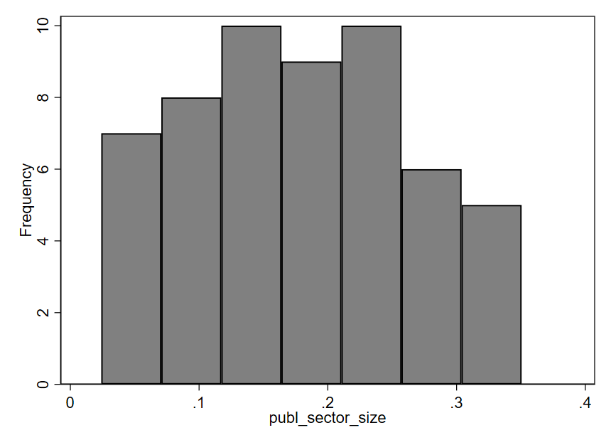
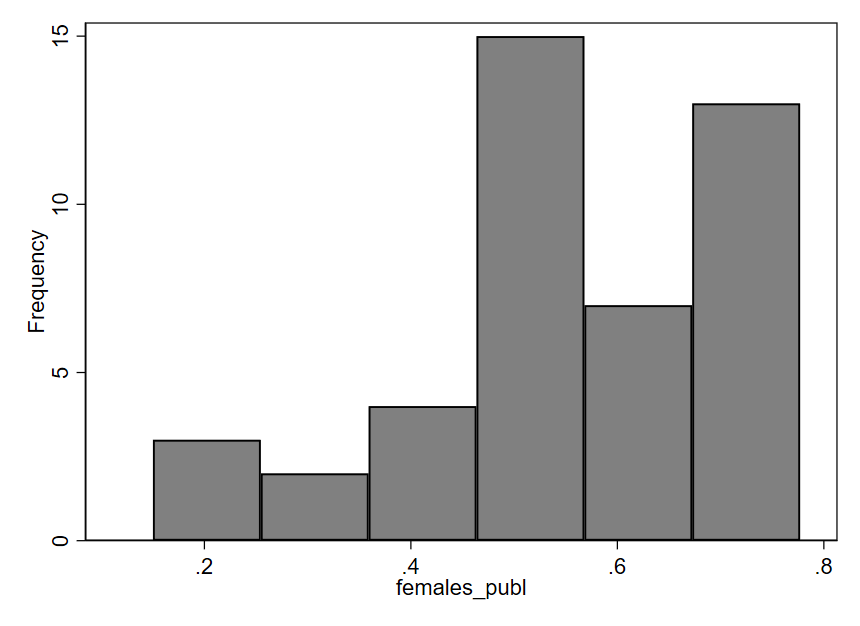
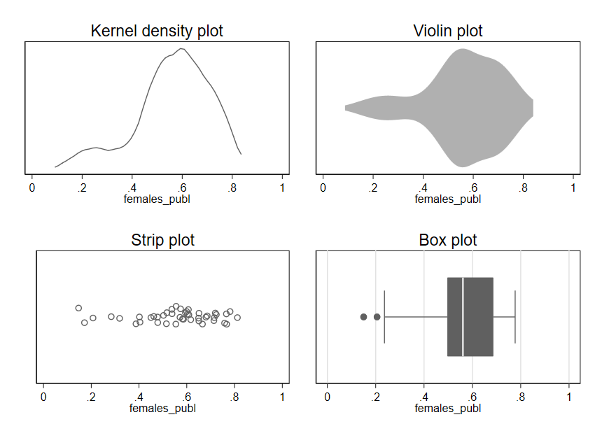
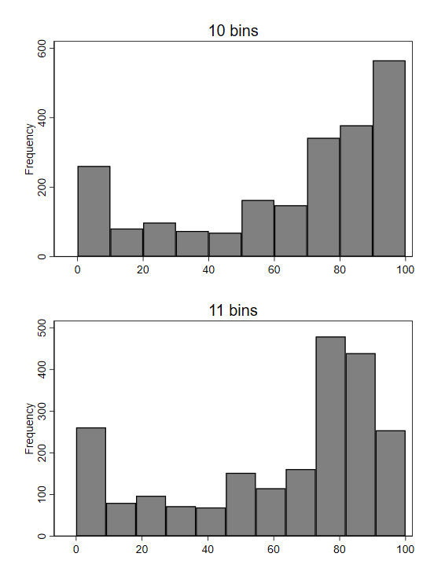
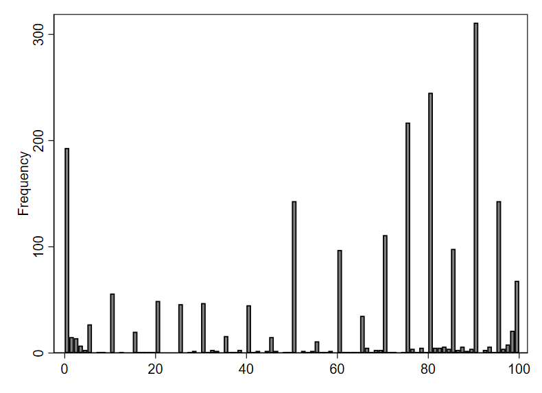
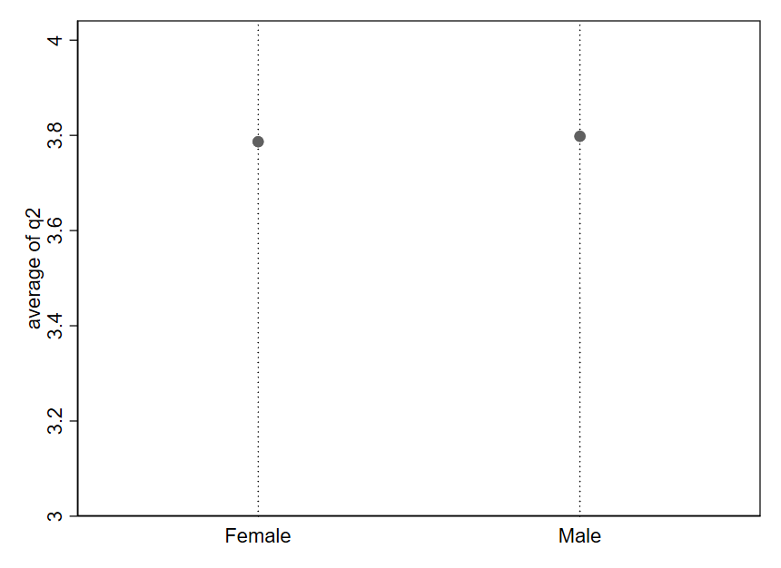
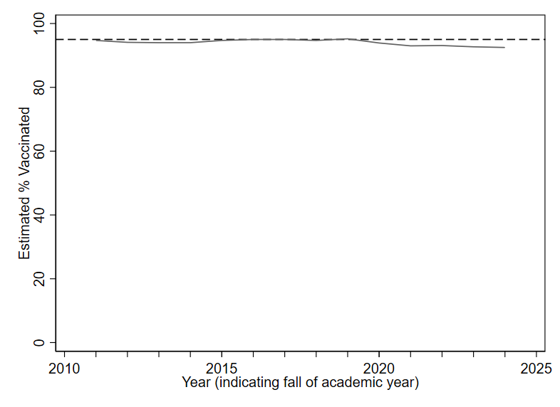
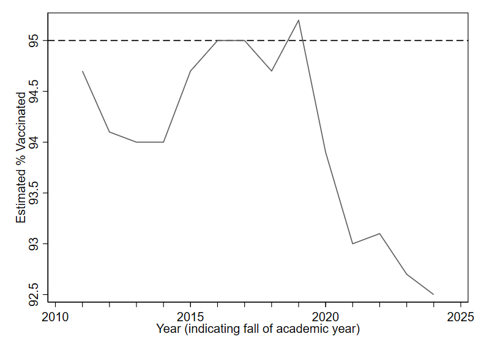

# Getting Started with Data {#sec-getting-started}

\[***Working draft notes for instructors**: Examples throughout the chapter will be revised to make wider use of the social media dataset from the initial example. The country-level dataset will likely be replaced by the social media one.*\]

Data is everywhere. Yet many of us find numbers intimidating. It can be tempting to assume that someone sophisticated enough to fluently cite numerical information must know what they're talking about. At the same time, there is a kind of backlash to using numbers to describe the world. The title of the popular book *How to Lie with Statistics* captures a cynicism many people feel: since statistics can easily trick you, you shouldn't believe them at all. Such extreme reactions reflect people's lack of self-confidence in evaluating quantitative information. Because we don't trust ourselves, we reflexively either dismiss or accept numerical claims—perhaps depending on whether the claim is one we already agree with or the source is one we trust.

Fortunately, statistics is a topic that most anyone can learn. Even if you think you are not a "numbers person," I am confident you can learn fundamentals that will allow you to critically assess statistical claims. I say this as someone who has spent much of my academic life surrounded by people who lacked confidence in their numerical abilities and yet decided to study social science topics—sometimes not realizing the extent to which they were signing up to work with numbers along the way. Many peers during my time studying for a PhD thought their abilities in math were not strong, but by the time they completed their degrees, they were all exceptionally competent in statistics. It is true that some people learn numerical material more quickly than others. For most people, lots of repetition is required before many statistical concepts are grasped. But I have yet to encounter a student who is unable to learn statistics. If you set your mind to it, you will learn it.

In my opinion, the most important skill for dealing with statistics is critical thinking. While statistics is certainly quantitative, doing statistical analysis does not require you to perform complex math because software will handle the number crunching. Thus, being comfortable with statistics is mostly about developing familiarity with statistical concepts, mastering a few technical details, and thinking carefully about how to best apply statistical tools to real-world data. "Subject-matter expertise," by which I mean familiarity with the topics (e.g., policy or program area) described by the data, is almost always required for good interpretation of statistical results. Sometimes, a bit of math will help with explaining how a statistic works or gaming out the implications of a statistical result. But even then, most of the math we need for an introductory course is relatively simple arithmetic.

This book will teach you the basics of statistics, with a focus on applications to the social sciences. It is intended for complete beginners, especially those taking an introductory statistics or quantitative methods course at the post-secondary level (e.g., at a college or university). The first half of the book (chapters 1-6) is a crash course on data essentials. It will help you get started using various tools to describe and analyze data. The second half of the book (chapters 7-12) goes into more detail on how to understand statistical tools and use data to learn about the social world. Many of the topics are more abstract than in the first half, but the concepts covered will help you critically evaluate exactly what a dataset can and cannot tell you.

With the emergence of new and powerful forms of artificial intelligence (AI), many people are currently asking how the field of statistics will change going forward. While it is always difficult to predict the future, we are already seeing emerging AI technologies that can effectively perform and interpret many statistical analyses. If a machine can do statistics, you might wonder: what is the point of learning to do statistics yourself? One reason I believe it is still important to learn about statistics is that the quality of statistics-based analysis produced by AI systems can vary widely. Without your own understanding of statistics, it is very difficult to evaluate the quality of an analysis produced by AI. Even if it soon becomes the case that many statistical analyses are carried out almost entirely by AI, I believe it will still be important that humans can understand and critically evaluate AI output. In the future, you might end up using AI tools to help you accomplish statistical analysis that is relevant to your work or personal life. But you will almost certainly be a smarter "supervisor" of the AI tool if you have your own grasp of statistics. Learning is not something you can outsource to AI; you will have to think hard and engage with the material in this text yourself if you want to learn statistics.

## Three Questions to Always Ask about Data

To help focus your attention on thinking critically, I encourage you to ask the following three questions whenever you encounter statistical information:

1.  What is being measured?

2.  Who (or what) is in the dataset?

3.  How big are the differences?

::: {.callout-tip icon="false"}
## Example: Engagement Data from Social Media Posts {.unnumbered}

Suppose you have a friend who has been trying to use social media to build and strengthen their professional network. When this friend finds out that you're taking a statistics course, they start coming to you with questions about what they can learn from the engagement data from their social media account.

@tbl-social-media-stats shows some basic statistics for your friend's profile.

| \# of Posts | Average Length (Characters) | Average \# of Likes | Posts with Images |
|------------------|------------------|------------------|------------------|
| 70 | 164 | 6.5 | 23% |

: Summary of Data from Social Media Account {#tbl-social-media-stats}

@tbl-long-vs-short-posts provides a comparison of the number of "likes" for short versus long posts.

|   | Short Posts (\< 150 Char.) | Long Posts (at least 150 Char.) |
|----|----|----|
| **Average \# of Likes** | 2.4 | 10.5 |

: Comparison of Engagement with Short and Long Posts {#tbl-short-vs-long-posts}

To help evaluate these two tables, let us consider our three Questions to Always Ask about Data:

1.  **What is being measured?**

    Each row of @tbl-social-media-stats shows something that is relatively straightforward to measure. And yet, when we dig deeper, it is not always so clear how a straightforward measure relates to whatever it is we really care about. Your friend cares about using this social media account for professional networking. How can we measure success for that goal? Doing so is rather difficult. Making many posts might seem to aid that goal because more posts means more opportunities to be seen by professional peers. And yet this would not be productive if the posts are perceived as annoying or somehow make a bad impression on people. Perhaps "likes" are a better metric, but here it is important to ask exactly what is being measured? It is just a count of the number of people who click the "like" button for a given post. But we don't necessarily know *why* users decided to click "like." It is probably reasonable to assume that most users click like after having some positive reaction to a post. But many users with positive reactions may also just keep scrolling and never click the like button. Furthermore, a highly controversial post might generate many likes while also creating many negative reactions that will go unmeasured. If what we are really interested in is how a post is perceived, the number of "likes" is a rather crude measure. Still, it may be the best data available. Often, we have to make due with imperfect data, but we should make sure we acknowledge its limitations. Here, we might want to regularly reminder ourselves that the number of "likes" probably doesn't tell the whole story of how a post is perceived.

2.  **Who (or what) is in the dataset?**

    Again, there is a fairly straightforward answer to this question: the data describes all the posts from your friends account, in terms of volume (of posts), length, likes, and use of images. Typically when we ask this question, we should also consider what is *missing* from the data. For example, we might note that in @tbl-short-vs-long-posts, we don't know anything about the contents of the posts, other than their length. This becomes especially relevant when trying to draw conclusions from the table. A naive interpretation might be that to get greater engagement (more likes), your friend needs to write longer posts. But such advice could easily be misguided: writing more words just for the sake of length is poor communication. Maybe your friend tends to write shorter posts when they have less interesting things to say. Making these less interesting posts longer will not necessarily make them better! Instead, we need to try to figure out what it is about the longer posts that makes them seemingly more effective (at least when measured through likes). Unfortunately, we can't learn that from the data summaries contained in the two tables above. Some further digging is probably required to draw any strong conclusions based on @tbl-short-vs-long-posts. For example, maybe your friend can go read through their previous posts, checking for what might be different in the contents of the short versus the long posts.

3.  **How big are the differences?**

    This question is most relevant when making comparisons. There aren't necessarily any obvious comparisons to make it @tbl-social-media-stats. But @tbl-short-vs-long-posts makes a comparison. Is the difference in number of likes between short and long posts very big? I would say so. 10.5 likes is over four times as large as 2.4. So whatever is driving this difference in number of likes may well be worth your friend investigating, if they are trying to learn how to better post content that other users will find interesting enough to click the "like" button after seeing it.
:::

## How Datasets are Structured

We often display data in the form of a spreadsheet. @tbl-country-preview shows part of a dataset describing countries. Each row represents one country, and we call the rows **observations**. Each column represents one characteristic of the countries. We call the columns **variables**. Variables allow us to describe whatever it is we care about—concepts like size of the public sector, the share of workers who are female in the public (or private) sector, and whether a country is a former British colony. We can easily imagine adding other variables like country wealth, average education level, or government spending on social programs. We call the columns [vari]{.underline}ables because each column displays values of a characteristic that [varies]{.underline} depending on which observation we are talking about: in Guatemala, the public sector size is 0.064, while in Hungary it is 0.261. What do these numbers mean? Here, public sector size is measured as the proportion of employment that is in the public sector. We can convert a proportion to a percentage by shifting the decimal point two places to the right. Thus, in Guatemala, 6.4% of jobs are found in the public sector, whereas in Hungary the figure is 26.1%. The public sector is much larger in Hungary than in any other country shown in this table.

| country_name | publ_sector_size | females_publ | females_priv | former_british_colony |
|---------------|---------------|---------------|---------------|---------------|
| Guatemala | 0.0642733 | 0.437011 | 0.2751051 | 0 |
| Guinea-Bissau | 0.0535029 | 0.2742133 | 0.3592181 | 0 |
| Honduras | 0.0602268 | 0.5613141 | 0.3063367 | 0 |
| Hungary | 0.2614872 | 0.694158 | 0.3943521 | 0 |
| India | 0.0851988 | 0.3021879 | 0.1555202 | 1 |
| Indonesia | 0.097229 | 0.4430795 | 0.3249187 | 0 |

: Preview of a dataset of countries and their characteristics[^getting-started-1] {#tbl-country-preview}

[^getting-started-1]: Data sources are the [Worldwide Bureaucracy Indicators](https://datacatalog.worldbank.org/search/dataset/0038132/worldwide-bureaucracy-indicators) ([CC-BY 4.0](https://datacatalog.worldbank.org/public-licenses?fragment=cc)) and the [Colonial Dates Dataset](https://doi.org/10.7910/DVN/T9SDEW) (public domain).

@tbl-fevs-preview previews a dataset where each observation (row) is a different individual who responded to a survey. We use the term **unit of analysis** to describe what constitutes one observation in a dataset: in the prior table the unit of analysis was the country, whereas here it is the individual. Other common units of analysis include the organization, the work unit, and the subnational unit (e.g., city or region).

| random_id | race | hispanic | sex | q1 | q2 |
|------------|------------|------------|------------|------------|------------|
| 194868625278 | White  | No  | Male  | Neither Agree nor Disagree | Neither Agree nor Disagree |
| 152966380283 | White  | No  | Male  | Disagree | Strongly Disagree |
| 146904434378 | Other | No  | Female  | Agree | Agree |
| 161966059804 | White  | Yes  |  | Strongly Agree | Strongly Agree |
| 133516090099 | Black or African American  | No  | Male  | Agree | Agree |

: Preview of data from a 2024 survey of U.S. government employees[^getting-started-2] {#tbl-fevs-preview}

[^getting-started-2]: 2024 U.S. Federal Employee Viewpoint Survey (public domain)

### Types of variables

We also distinguish among different kinds of variables, which will often require different types of analysis.

**Quantitative variables** are expressed in numbers. The public sector size variable we examined above is quantitative.

For **qualitative variables**, it typically makes more sense to use text than numbers to describe the values. For example, race is a qualitative variable, as shown in the example survey data above. While you may sometimes encounter datasets that record the values of a qualitative variable using numbers (for ease of processing), the assignment of numbers to values will be arbitrary. This is because qualitative variables take on values that are unordered categories (cannot be arranged from least to most). Hispanic and sex are also qualitative variables in the example survey data.

A qualitative variable that takes on only two values is called a **binary variable**. The variables hispanic and sex are binary. For the sex variable, there is also one blank cell, indicating a missing value. Binary variables often appear in spreadsheets with values shown as 1s and 0s. In some cases, a 1 indicates “yes” while a 0 indicates “no.” For example, in the country data shown above, the variable “former_british_colony” is coded as a 1 if “yes, this country is a former British colony” and 0 if it is not.

There is also a third type of variable called an **ordinal variable**, where values can be arranged in order but cannot be easily quantified. This type exists in a somewhat grey zone between quantitative and qualitative. Many surveys utilize Likert scales, which allow respondents to choose from a range of options along a continuum (e.g., strongly disagree, disagree, agree, strongly agree). Variables q1 and q2 in the survey data example use this kind of scale. For q1, people are responding to the statement "I am given a real opportunity to improve my skills in my organization." Q2 asks them to indicate whether they agree that "I feel encouraged to come up with new and better ways of doing things." Likert scales result in ordinal variables: while we can arrange response options from most agreement to least agreement, it is not clear how to assign precise numbers because we don’t know if the distances between response options are equal. If “strongly disagree” is a 1 and “disagree” is a 2, should “neither agree nor disagree” be a 3? Or a 4? Maybe 3.5? It is difficult to say what numbering scheme would most accurately represent respondents’ attitudes because this is an ordinal variable.

### Types of datasets

So far, the datasets we have seen are what we call **cross sections**. Each observation is a different unit. There are also **time series** datasets, where each observation is a different point in time. We saw an example of time series data on U.S. education being depicted graphically at the beginning of the chapter. @tbl-edu-spending shows some of this same data displayed as a spreadsheet. With time series data, the unit of analysis could be the year (as in this example), the quarter, the month, the week, the day, etc.

| year | spending_per_pupil |
|------|--------------------|
| 1973 | 7817               |
| 1974 | 7994               |
| 1975 | 8235               |
| 1976 | 8445               |

: Time series data (U.S. education spending) {#tbl-edu-spending}

You may also sometimes encounter more complicated data structures that combine the attributes of cross-sectional and time series data. A **panel** dataset tracks multiple units over multiple time periods. For example, a dataset might track several countries over several years (each row describing one country in one year). A **repeated cross section** is similar, except that different units are observed in each time period. A survey that is conducted annually but where the respondents are different each year is a repeated cross section.

### Varying terminology

Unfortunately, there are many cases where statistical terminology is inconsistent from one source to the next. Since you will probably encounter research reports or articles that use different terminology than I use here, it is important to be familiar with these alternative terms:

-   Qualitative variables can also be called **categorical variables** or **nominal variables**.

-   Binary variables are often called **dummy variables**.

-   Time series data is sometimes called **longitudinal data**.

Sources also disagree on whether ordinal variables should be considered a subcategory of quantitative or qualitative variables. For this text, I consider ordinal variables to be a distinct third category, but different authors classify them differently.

## Visualization Basics

Creating simple graphs is often a great first step for getting familiar with a dataset. In this chapter, we will focus mainly on graphing just one variable at a time.

### Qualitative and ordinal variables

For qualitative and ordinal variables, we often use bar charts to depict the frequencies of different values. (We can also sometimes use bar charts to depict quantitative variables if all values are whole numbers, as we will see next chapter in @fig-quiz-1.)

{#fig-bar-race width="400"}

One can quickly see from @fig-bar-race that the most common value for the race variable is White, meaning that most U.S. government employees responding to the survey are White. We also see that the values of Asian and Other are fairly rare (each occurring in fewer than 10% of observations). Black or African American occurs a bit more frequently (around 15% of observations).

Another type of graph you can create with qualitative data is a pie chart, using the frequency of each value to create the size of the pie slice. Pie charts visually suggest a zero-sum approach to thinking about the sizes of the different categories: you can't make one slice bigger without making at least one other slice smaller. This makes pie charts particularly effective for depicting something like a budget allocation where a scarce resource is being distributed across categories. However, a zero-sum allocation is not always what we wish to emphasize when summarizing a qualitative variable. Pie charts can also be hard to read with certain configurations of data (i.e., when there are too many categories or the slices get too small). Thus, it should come as no surprise that research scientists tend to rely on bar charts more than pie charts for depicting qualitative variables.

{#fig-pie-race width="400"}

Note that bar charts and pie charts can be used to represent things other than the frequency with which different values of a variable occur, even though that is the main way we use them while studying statistics. When you encounter a graph, it is always important to carefully read the titles and labels to make sure you understand exactly what is depicted. A bar graph might, for example, indicate the size of the change (positive or negative) in the budget from 2024 to 2025 for various categories of spending. Or as noted above, you might see the levels for budget categories themselves depicted in a pie chart—highlighting how some categories make up much larger shares of the budget than others. In such cases, the charts would not be telling you how many observations (rows of data) record different values of a variable, as in the example graphs shown here.

### Quantitative variables {#sec-quantitative-variables}

Perhaps the most popular type of graph for visualizing a single quantitative variable is a histogram. An example is shown below, using the publ_sector_size variable we discussed above. In a histogram, each bar represents a range of values, known as a “bin.” The x-axis (along the bottom of the graph) shows us the range of values for the publ_sector_size variable being described by each bar. The height of each bar represents how many data points fall within the corresponding bin. In this particular histogram, the y-axis (along the left side of the graph) shows how different heights indicate different numbers of observations. For example, the first bar on the left has a height indicating seven observations. The approximate range shown on the x-axis for this bar is .02 to .07. Therefore, seven countries have a public sector size between approximately .02 and .07, meaning that 2-7% of employment in those countries is within the public sector. The right-most bar indicates that 5 countries—those with the largest public sectors—have approximately 30-35% of all workers employed by the public sector. Most countries in this dataset lie between the two extremes depicted by the left-most and right-most bars. There are more observations in the middle three bins (indicated by the taller bars) than there are in the two left-most or the two right-most bins.

{#fig-hist-publ_sector width="400"}

Now, let's examine a histogram for the variable females_publ, which indicates the proportion of public sector employees who are female. In this graph, we can notice a certain asymmetry: the bars on the right half of the graph tend to be taller than those on the left. The short bars indicate that relatively few countries have proportions in the approximate range of .1 to .45; in other words, for a small number of countries, we see that 10-45% of the public workforce is female. Most countries have a public workforce that is more like 45-75% female (the tall bars on the right side of the graph). Thus, it seems that in a majority of the 44 countries included in this dataset, the public sector employs more females than males.

{#fig-hist-females_publ width="400"}

There are several alternatives to histograms. You can see in @fig-various-females_publ several different types of graphs being used to depict the same data for the females_publ variable. Each one indicates the relative density of observations across the range of possible values. Much like a histogram, a kernel density (k-density) plot uses height to indicate the frequency with which values occur, but rather than dividing values up into discrete ranges (bins), an algorithm is used to create a smooth, continuous line that is drawn across the values. A violin plot (which can be oriented horizontally or vertically) is somewhat similar but uses thickness rather than height to indicate density of observations across the range of values. A strip plot uses one dot per observation but usually adds some random noise called "jitter" to the data. Without this jitter, dots often stack on top of one another such that the actual density of observations is obscured. Finally, a box plot uses a box to indicate the range of values containing the middle 50% of observations, with other lines indicating other important quantities like the full range of values. Given the importance and complexity of box plots, we will examine them in more detail in the next chapter.

{#fig-various-females_publ width="550"}

Regardless of which type of plot we use, we see the same asymmetry apparent in the original histogram for females_publ: most of the data lies in the range of .4-.8, with a few observations also occurring in the range of .1-.4.

### Best practices for simple graphs

As useful as graphs are, it is also easy to go wrong with data visualization. Here are three guidelines to keep in mind when getting started with graphs.

First, the simple graphs we examined for quantitative variables are typically a good starting point for learning about a variable, but there may be important details that are not apparent from the first graph we look at. For example, while histograms usually provide a nice overview of a variable, the overall shape depicted by the bars in a histogram can sometimes change in surprising ways if we alter the boundaries of the bins.

::: {.callout-tip icon="false"}
## Example: Estimates of Small Donations {.unnumbered}

A survey of nonprofits asked each respondent to estimate the percentage of individual donations to their organization in 2019 that were smaller than \$250.[^getting-started-3] Look at how different the right-most bars of the histogram look, depending on whether we use 10 bins or 11 bins (a setting we can change in the software creating the histogram):

{#fig-bin-settings width="400"}

Why the dramatic change? If we plot bins with a width of 1, we get a better sense of what is unusual about the underlying data:

{#fig-bin-width-1 width="400"}

From this more fine-grained depiction of the data, we see that respondents appear to typically answer with numbers divisible by 5. Remember, survey respondents were asked to provide an estimate—not look up the exact number from their records. People are more likely to offer estimates that are "round" numbers like 90 or 95, as opposed to something like 92.

In the initial histogram with 10 bins, the right-most bin included the value 90—the most popular answer. When we switched to using 11 bins, the right-most bin was redrawn to exclude 90, so the number of observations in the bin (represented by its height) dropped dramatically. Because of the spikes in frequency at round numbers (divisible by 10 or 5), changes in bin settings can cause relatively large changes to the visual pattern of the histogram.
:::

[^getting-started-3]: Year 1 of the Nonprofit Trends Longitudinal Survey Public Use Data Files. <https://doi.org/10.7910/DVN/T4OT1J>

Second, be careful about using line graphs. When working with time series data, we often depict quantitative variables using a line graph. As we already saw in our example on trends in U.S. education, line graphs allow one to visually observe trends over time. While line graphs are appropriate for depicting time series data, their use in other contexts is often misleading, since the lines suggest connections between points that may not be connected at all in reality.

Third, "keep it simple" is a great mantra to remember for data visualization (and much of data analysis). It is no accident that the graphs we have just reviewed are visually quite simple—maybe even boring. Some software programs will point you toward features like 3-dimensional graphs or using images instead of bars to depict information. While such graphs may look impressive on the surface, the flourishes usually distract from the main point of the graph (and can sometimes even actively mislead the reader).[^getting-started-4] Focus on simplicity and clarity in data visualization, not trying to stand out.

[^getting-started-4]: See, for example, violations of the "principle of proportional ink": <https://callingbullshit.org/tools/tools_proportional_ink.html>

## Critically Evaluating Graphs {#sec-critically-evaluating-graphs}

Graphs are often poorly constructed in ways that can mislead, so it's always important to think critically and exercise caution when interpreting data visualizations.

Let's look at some examples and see if any of the Three Questions to Always Ask about Data can help us identify misleading graphs.

::: {.callout-tip .unnumbered icon="false"}
## Example: Differences in employee attitudes by sex

Q2 from the survey of federal employees asks whether there is a workplace environment supportive of innovation. As already noted, this variable is ordinal, meaning it is not obvious what numbers would be most appropriate to attach to the variable values. Nonetheless, we adopt here the common practice of starting from 1 and counting up by whole numbers for the different response option:

-   Strong Disagree = 1

-   Disagree = 2

-   Neither Agree nor Disagree = 3

-   Agree = 4

-   Strongly Agree = 5

We're not sure if these numbers are really the ideal ones to assign, but they are a reasonable approximation of how attitudes might be mapped to numbers. And by assigning precise numbers to the response options, we enable treating this variable as quantitative. This is beneficial because quantitative variables are often easier to work with than qualitative variables. For example, we can calculate the average of a quantitative variable. The overall average of the q2 variable is 3.79, which is a bit less than the value we assigned to Agree. We can also compute averages for different subsets of survey respondents. For example, we can compute separate averages by sex (separating out males and females) and display these averages in a simple graph. Here is one possibility for what that graph could look like:

{#fig-gender-compare-zoomed-in width="400"}

A quick glance at this graph suggests that males feel much more supported in pursuing innovation than than females. But our third Question to Always Ask about Data indicates we should consider "How big is the difference?" Look closely at the y-axis here. The average response for females appears to be around 3.787, while the average response for males is approximately 3.798. That is a tiny difference—just .011 on a 1-5 scale. In reality, male and female respondents report very similar average levels of support for pursing innovation. It is just that the figure is depicting a very narrow portion of the range for this variable, which makes a mole hill look like a mountain.

Let's look at what happens when we redraw the y-axis:

{#fig-gender-compare-zoomed-out width="400"}

Now, the difference in averages between females and males is difficult to visually detect because the dot for Male is barely higher up than the dot for Female. Notice the values on the y-axis: the range begins at 3 (Neither Agree nor Disagree) and ends at 4 (Agree). We have "zoomed out" on the difference we saw in @fig-gender-compare-zoomed-in.
:::

Generally speaking, any difference can be made to visually look very large or very small depending on how the axes are drawn. It is all about how "zoomed in" or "zoomed out" you are relative to the range of possible values for the variable.

It is sometimes tempting to create simplistic rules to try to avoid misleading graphs like the one from the prior example. Such rules are generally a bad substitute for carefully thinking through how to best describe the data in front of us. As an example, it is sometimes advised to always including 0 in the y axis in order to avoid "zooming in" on the y axis so much that we make small differences appear larger than they really are. Let's consider this rule in the context of some data on trends in childhood vaccination.

::: {.callout-tip icon="false"}
## Example: Childhood Vaccination Rates {.unnumbered}

Public health officials advise that at least 95% of the community should be vaccinated against measles in order to maintain herd immunity.[^getting-started-5] @fig-vaccines-zoomed-out shows estimates for the rate of measles-mumps-rubella (MMR) vaccination in the U.S. among children starting primary school (solid line).[^getting-started-6] The y-axis is drawn to start at 0, and the target rate of 95% is depicted as a dashed line. The solid line looks almost flat and is always close to the dashed line. It is hard to say much more based on this graph, except that the actual vaccination rate appears to fall a bit shy of the 95% target in recent years.

{#fig-vaccines-zoomed-out width="400"}

Now look at the following alternative. While the exact same data is being depicted in @fig-vaccines-zoomed-in, the redrawn y axis makes the solid line look like it is moving a lot (suggesting big year-to-year differences). Prior to 2020, rates were pretty consistently within the 94-95% range. But more recent years show rates two or three percentage points below the 95% target. Given the potential public health implications of falling just one or two percentage points below the target of 95% vaccine coverage, it does not seem like a smart choice to include 0 on the y axis for this data (as in @fig-vaccines-zoomed-out), since doing so makes it quite difficult to precisely discern changes of one or two percentage points.

{#fig-vaccines-zoomed-in width="400"}
:::

[^getting-started-5]: Pandey, A., & Galvani, A. P. (2023). Exacerbation of measles mortality by vaccine hesitancy worldwide. *The Lancet Global Health*, *11*(4), e478-e479. <https://doi.org/10.1016/S2214-109X(23)00063-3>

[^getting-started-6]: [Data](https://data.cdc.gov/Vaccinations/Vaccination-Coverage-and-Exemptions-among-Kinderga/ijqb-a7ye) from the U.S. Centers for Disease Control and Prevention.

For good visualization, we want differences that are meaningful in reality to be visually noticeable in our graphs. How do we define a "meaningful" difference? There is no universal rule. Typically, subject-matter expertise and careful judgment will be our best guides.

Whenever you see a difference in a graph that "looks big" or "looks small," take a moment to pause. Look carefully at the numbers on the axes, and think about how to evaluate the third Question to Always Ask about Data: "Based on what I know about this topic and how the variables are measured, *how big is this difference*? Does my understanding of the numbers match what my eyes see?"

## Exercises

1.  What are the three Questions to Always Ask about Data?

2.  What types of variables are `voter_registration`, `follows_news`, and `years_living_in_state` in the table below?

    | id  | voter_registration  | follows_news      | years_living_in_state |
    |-----|---------------------|-------------------|-----------------------|
    | 1   | registered          | somewhat agree    | 26                    |
    | 2   | ineligible          | strongly disagree | 51                    |
    | 3   | unregistered        | strongly agree    | 2                     |
    | 4   | registered          | somewhat agree    | 34                    |
    | 5   | registered          | somewhat disagree | 44                    |
    | 6   | unregistered        | strongly agree    | 11                    |

3.  What is the unit of analysis in the table from question 2?

4.  If I have a dataset where the unit of observation is the week, what type of dataset do I have?

5.  What is another name for a qualitative variable?

6.  Are pie charts or bar charts more popular among scientists for depicting a qualitative variable?

7.  What are three best practices for creating graphs (as described in this chapter)?

8.  Why is it important to carefully read the labels on a graph's axes?
