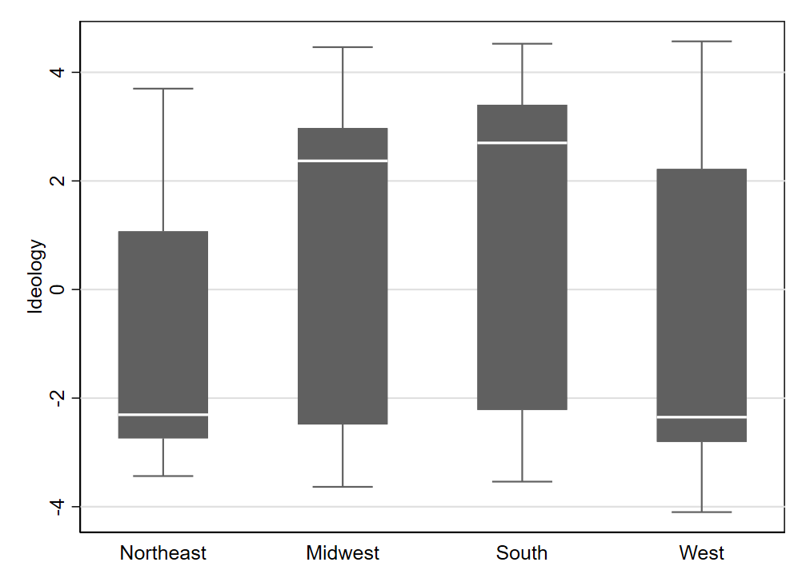
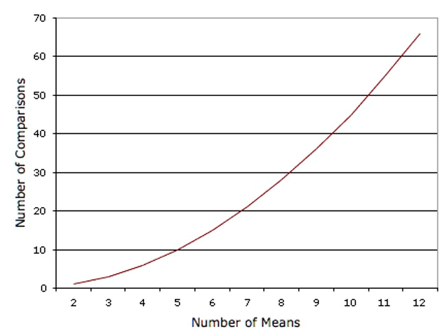
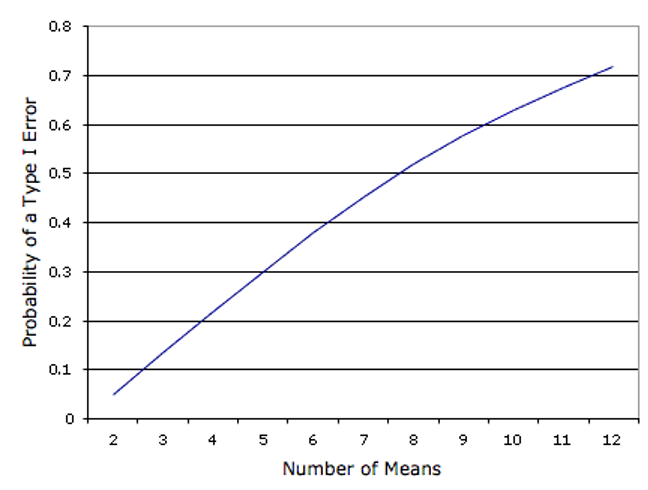
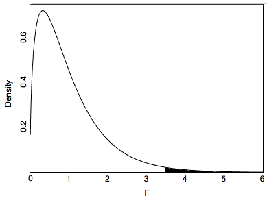

# Hypothesis Testing {#sec-h-tests}

Hypothesis tests allow us to determine whether a finding is “statistically significant,” an idea we briefly encountered in @sec-correlation when discussing how to interpret regression results tables. Testing for statistical significance is the dominant way that the probabilistic conclusions from inferential statistics are communicated in science. However, many statisticians (and other methodologists) have criticized this broad reliance on significance testing as overly simplistic, confusing, or otherwise ill-founded. Hypothesis testing is important to learn because of its widespread use, but confidence intervals are often more informative for describing statistical results.

As we will see in this chapter, hypothesis testing can often be understood as a particular application of confidence intervals. The risk with hypothesis tests is that we reduce our results down to a binary (significant or not significant), ignoring other nuances that may be present in the results. We will discuss some of these limitations in more detail throughout this chapter.

## Getting Started: A Binary-Quantitative Relationship

We learned in @sec-qual-associations that we can use a comparison of means to evaluate how a binary (qualitative) variable relates to a quantitative variable. To see how hypothesis testing applies when comparing two means, we will use data on congressional districts in the U.S. Each district elects a single member (a congressperson) to the U.S. House of Representatives. We have a binary variable `rural` indicating whether a majority of the district’s residents live in a rural area. A quantitative variable `ideology` is an estimate of the political ideology of the elected official representing that district. Ideology can be measured on a continuous left-to-right scale (also called “liberal” to “conservative” in the US political system), with higher values indicating an official is further to the right.

### Null and Alternative Hypotheses

The starting point for hypothesis testing is a null hypothesis. Practically speaking, the null hypothesis usually indicates that there is no relationship between variables. So if we are comparing two means, the null hypothesis would typically be that the two means are the same. The null hypothesis always describes a parameter being estimated, not a sample statistic. Therefore, when writing a null hypothesis as an equation, we generally use Greek letters. For example, a null hypothesis may contain one or more instances of $\mu$, representing a population mean. If there is no clearly-defined population, $\mu$ might represent the "expected value" (defined in the following chapter) for a variable that we assume was generated through a (partially) random process. The latter interpretation is probably more appropriate to the example data we're using. $H_0$ is how we formally denote the null hypothesis, so for our data example we can write:

$$
H_0: \mu_R = \mu_U
$$ {#eq-rural-null-equal-means} using the subscripts $U$ and $R$ to indicate "urban" and "rural," and $\mu$ indicates the expected value (or population mean) of the quantitative variable: `ideology`. So according to the null hypothesis, the expected value of `ideology` among rural districts is the same as the expected value of `ideology` among urban districts.

Another way to write this same null hypothesis is:

$$
H_0: \mu_R - \mu_U = 0
$$ {#eq-rural-null-diff-means} that the difference in the expected value of `ideology` between rural versus urban districts is zero (there is no difference).

As we learned in @sec-qual-associations, we can use a regression equation to indicate a difference in means. Thus, we often rewrite $\mu_R - \mu_U$ as $\beta$:

$$
H_0: \beta = 0
$$ {#eq-rural-null-beta} in an an experimental context, $\beta$ might represent an average treatment effect (which is, in fact, a difference in expected values).

Every null hypothesis should be paired with an alternative hypothesis, which is normally the logical opposite of the null hypothesis. We write $H_A$ to represent the alternative hypothesis, and our alternative to @eq-rural-null-equal-means is:

$$
H_0: \mu_R \neq \mu_U
$$ {#eq-rural-alt-equal-means}

Or equivalently:

$$
H_0: \mu_R - \mu_U \neq 0
$$ {#eq-rural-alt-diff-means}

Or:

$$
H_0: \beta \neq 0
$$ {#eq-rural-alt-beta}

Moving forward, we will focus on the final form in which we've written the null and alternative hypotheses (@eq-rural-null-beta and @eq-rural-alt-beta). We have already learned that confidence intervals can be constructed for regression coefficients, so let's see if we can evaluate these hypotheses using a confidence interval from a regression.

### Evaluating Hypotheses with a Confidence Interval

@tbl-ideology-region presents results for a regression where ideology is the dependent variable and the binary variable `rural` is the independent variable. The table includes confidence intervals for the coefficients:

+-------------+------------+------------+------------+--------------------+
|             | Coef.      | Std. Err.  | p-value    | 95% Conf. Interval |
+=============+============+============+============+====================+
| rural       | 2.294      | 0.446      | 0.000      | \[1.418, 3.170\]   |
+-------------+------------+------------+------------+--------------------+
| (intercept) | -0.024     | 0.140      | 0.864      | \[-0.299, 0.251\]  |
+-------------+------------+------------+------------+--------------------+
|             |            |            |            |                    |
+-------------+------------+------------+------------+--------------------+
| n           | 435        |            |            |                    |
+-------------+------------+------------+------------+--------------------+
| r\^2        | 0.058      |            |            |                    |
+-------------+------------+------------+------------+--------------------+

: Results for a regression with ideology as the dependent variable {#tbl-ideology-rural}

The row labeled `rural` corresponds to what we have written as $\beta$ in our hypotheses. The null hypothesis indicates that $\beta$ is 0, but the value of 0 is not included within the range identified by the 95% confidence interval (0 is not between 1.418 and 3.170). Thus, we can *reject* the null hypothesis. The alternative hypothesis indicates that $\beta$ is not zero, and the 95% confidence interval suggests that $\beta$ is indeed not zero. Thus, we *accept* the alternative hypothesis. Given that null and alternative hypotheses are always logical opposites, we will accept the alternative hypothesis if we reject the null hypothesis.

Because we reject the null hypothesis of no relationship between the two variables, we can say that the relationship is *statistically significant*. We previously learned to draw this same conclusion by seeing that the coefficient's p-value is less than 0.05.

If the 95% confidence interval for the `rural` coefficient included 0 (i.e., if the lower bound was negative and the upper bound was positive), we would have *failed to reject* the null hypothesis.

### Substantive Significance

A word of caution about our conclusion here: statistical significance doesn't mean that the relationship between variables is strong—only that we could reject the possibility of a relationship being entirely absent (i.e., we reject the notion that the expected value of ideology is exactly the same in rural and urban districts). To assess whether a relationship is strong or *substantively* significant, we need to use tools other than standard hypothesis tests (such as scrutinizing the range of the confidence interval, as we did in the prior chapter). This is one reason I encourage you to always consider "How big are the differences?" (the third Question to Always Ask about Data): many publications clearly indicate statistical significance but do not devote sufficient attention to substantive significance.

In this case, assessing substantive size is a bit difficult because the measure of ideology is on a scale that is not very easy to interpret. Ideology scores (among congresspersons in this sample) range from -4.10 to 4.57, and the standard deviation is 2.85. Since the smallest number (in absolute value) within the confidence interval for the `rural` coefficient is its lower bound of 1.42, we can say that the systematic difference between urban and rural districts appears to be at least half a standard deviation (approximately). A difference of half a standard deviation is generally considered to be quite large, so we can say that congresspersons from rural districts are notably further to the right politically (more conservative) than congresspersons from urban districts.

While I will not walk through an analysis of substantive size for every example presented in this chapter (for sake of brevity), it is almost always important in applied research to consider substantive strength of associations when interpreting statistically significant findings.

## Qualitative-Quantitative Relationships

What about qualitative variables for which there are more than two values? @tbl-ideology-region shows results for a regression where the independent variable is now the qualitative variable `region`, coded according to the U.S. Census Bureau's delineation of the country into four regions. Northeast is the omitted category (see @sec-prediction-with-multiple-categories).

+-------------+-----------------+------------+------------+--------------------+
|             | Coef.           | Std. Err.  | p-value    | 95% Conf. Interval |
+=============+=================+============+============+====================+
| Northeast   | \-              | \-         | \-         | \-                 |
+-------------+-----------------+------------+------------+--------------------+
| Midwest     | 1.885           | 0.413      | 0.000      | \[1.074, 2.697\]   |
+-------------+-----------------+------------+------------+--------------------+
| South       | 2.602           | 0.369      | 0.000      | \[1.878, 3.327\]   |
+-------------+-----------------+------------+------------+--------------------+
| West        | 0.468           | 0.401      | 0.244      | \[-0.320, 1.256\]  |
+-------------+-----------------+------------+------------+--------------------+
| (intercept) | -1.285          | 0.305      | 0.000      | \[-1.884, -0.686\] |
+-------------+-----------------+------------+------------+--------------------+
|             |                 |            |            |                    |
+-------------+-----------------+------------+------------+--------------------+
| N           | 435             |            |            |                    |
+-------------+-----------------+------------+------------+--------------------+
| r2          | 0.140           |            |            |                    |
+-------------+-----------------+------------+------------+--------------------+
| F(3, 431)   | 23.35 (p=0.000) |            |            |                    |
+-------------+-----------------+------------+------------+--------------------+

: Results for a regression with ideology as the dependent variable {#tbl-ideology-region}

In this regression, each slope coefficient indicates that the difference between the mean (expected value) for the given region and the omitted category (Northeast). The null hypothesis should indicate that there is no relationship between the two variables `region` and `ideology`, but what does that look like in practice?

### Null and Alternative Hypotheses

If there is no relationship in this context, then changing the value of `region` should result in no change in the prediction for `ideology`. This implies that each pair of differences should be equal to 0, so all regression slope coefficients should be 0 (according to the null hypothesis). We can write this as a single hypothesis, using $\beta_1$ to indicate the first slope coefficient, $\beta_2$ to indicate the second slope coefficient, and so on:

$$
H_0: \beta_1 = \beta_2 = \beta_3 = 0
$$ {#eq-region-null-betas}

If all differences between categories are 0, this implies that the means (or expected values) for all regions are equal, so another way to write this hypothesis is:

$$
H_0: \mu_N = \mu_M = \mu_S = \mu_W
$$ {#eq-region-null-means} the subscripts ($N$, $M$, $S$, and $W$) indicate each region by its first letter.

What does our alternative hypothesis look like? For the null hypothesis to be false, at least one pair of regions must differ in their means (or expected values). We can write this more formally in either of the two following forms:

$$
H_A: \beta_i \ne 0 \text{ for some } i
$$ {#eq-region-alt-betas}

$$ H_A: \mu_i \ne \mu_j \text{ for some } i,j$$ {#eq-region-alt-means}

### Evaluating Hypotheses with an F Test

How can we use the regression output to evaluate these hypotheses? A natural place to start is by again evaluating the confidence intervals on each slope coefficient: while the coefficient for West could very well be 0 (0 is within the confidence interval), the confidence intervals for Midwest and South both contain all positive (non-zero) values. Thus, we can conclude that the expected value of ideology for congresspersons in the Widwest is different than in the Northeast, and there is also a difference for the South versus the Northeast. This would seem to imply that the null hypothesis (@eq-region-null-betas) should be rejected.

However, this approach of evaluating each slope coefficient one-by-one is not the ideal way to test the null hypothesis indicated in @eq-region-null-betas. Instead, it is better to take an all-in-one approach to match the nature of the hypothesis, which makes statement about three coefficients. While there is no easy way to do this with confidence intervals, we can utilize something called an F test, which provides a p-value like we used when learning about statistical significance for regression. The typical F test that is performed by default with a regression in many statistical software packages is designed to test the null hypothesis that all coefficient slopes are equal to zero, which is exactly what we want in this case. You may have noticed that the bottom of @tbl-ideology-region included an extra row we've not seen in prior regression tables that displays an F statistic (23.35) and a corresponding p-value (0.000). The exact details of how this F test is conducted are beyond the scope of this chapter, but you can use what you've already learned (in the context of regression slopes) about comparing p-values to a .05 threshold to evaluate this null hypothesis. Because this p-value is less than .05, we reject the null hypothesis and conclude that at least one slope coefficient is non-zero. Thus, we conclude that at least one region has a different mean (or expected value) from another region.

### Pairwise Comparisons

Note that the alternative hypothesis we accepted in the prior section is particularly vague: we only know that at least one region differs from at least one other region. While that is meaningful in the sense that it tells us region of country is related to congresspersons' ideology, it is a rather open-ended conclusion. Because analysts often want to provide more specific description of where there are differences across categories, it is common when examining a qualitative-quantitative relationship to also evaluate "pairwise" hypotheses that compare only two categories at a time. When there are four categories for the qualitative variable, there are a total of six unique pairings. One way to write the null hypotheses for these six comparisons is as follows:

$$
H_0: \mu_N = \mu_M
$$$$
H_0: \mu_N = \mu_S
$$$$
H_0: \mu_N = \mu_W
$$$$
H_0: \mu_M = \mu_S
$$$$
H_0: \mu_M = \mu_W
$$$$
H_0: \mu_S = \mu_W
$$ {#eq-region-nulls-pairwise}

@tbl-ideology-region allows us to easily test the first three. In fact, we already observed that the first and second hypothesis can be rejected but the third cannot (since the coefficient for West could plausibly be 0, given the 95% confidence interval). It may seem odd that I am returning to evaluating each comparison one-by-one, after I said earlier in this section that doing so was not a good way to evaluate @eq-region-null-betas. What is important to highlight is that the way we test the single hypothesis @eq-region-null-betas is different from how we test a series of pairwise null hypotheses (@eq-region-nulls-pairwise). While the distinction can be confusing, since the series of pairwise nulls implies in combination the single combined null, the details of how we evaluate a single hypothesis differ from testing a series of hypotheses. For this reason, it is also possible (though not particularly common) that our results with the pairwise hypotheses will appear to contradict our results for the single combined hypothesis. Applied researchers commonly use both the combined single hypothesis and the pairwise series of hypotheses, sometimes in combination and sometimes separately. Thus, it is important to be familiar with both approaches to testing a qualitative-quantitative relationship. When results seem to differ from the two approaches, it is hard to give broad advice about which testing approach to favor since researchers apply varied standards and different research settings may merit different priorities.

Returning to the present example, the first three of the pairwise null hypotheses (in @eq-region-nulls-pairwise) can be evaluated with the results from @tbl-ideology-region, but what about the other three? We can re-specify the regression by changing the omitted category, in order to make the remaining three comparisons. @tbl-ideology-region-pairwise shows the results, with information corresponding to each coefficient (standard errors, p-values, and confidence intervals) now shown in vertical rather than horizontal format, in order to make space to display four regression models in one table.

+-------------+-------------------+-------------------+-------------------+-------------------+
|             | Model 1           | Model 2           | Model 3           | Model 4           |
+=============+===================+===================+===================+===================+
| Northeast   | \-                | -1.885            | -2.602            | -0.468            |
+-------------+-------------------+-------------------+-------------------+-------------------+
|             | \-                | (0.413)           | (0.369)           | (0.401)           |
+-------------+-------------------+-------------------+-------------------+-------------------+
|             | \-                | p=0.000           | p=0.000           | p=0.244           |
+-------------+-------------------+-------------------+-------------------+-------------------+
|             | \-                | \[-2.697,-1.074\] | \[-3.327,-1.878\] | \[-1.256,0.320\]  |
+-------------+-------------------+-------------------+-------------------+-------------------+
| Midwest     | 1.885             | \-                | -0.717            | 1.418             |
+-------------+-------------------+-------------------+-------------------+-------------------+
|             | (0.413)           | \-                | (0.347)           | (0.381)           |
+-------------+-------------------+-------------------+-------------------+-------------------+
|             | p=0.000           | \-                | p=0.040           | p=0.000           |
+-------------+-------------------+-------------------+-------------------+-------------------+
|             | \[1.074,2.697\]   | \-                | \[-1.399,-0.034\] | \[0.668,2.167\]   |
+-------------+-------------------+-------------------+-------------------+-------------------+
| South       | 2.602             | 0.717             | \-                | 2.135             |
+-------------+-------------------+-------------------+-------------------+-------------------+
|             | (0.369)           | (0.347)           | \-                | (0.333)           |
+-------------+-------------------+-------------------+-------------------+-------------------+
|             | p=0.000           | p=0.040           | \-                | p=0.000           |
+-------------+-------------------+-------------------+-------------------+-------------------+
|             | \[1.878,3.327\]   | \[0.034,1.399\]   | \-                | \[1.480,2.789\]   |
+-------------+-------------------+-------------------+-------------------+-------------------+
| West        | 0.468             | -1.418            | -2.135            | \-                |
+-------------+-------------------+-------------------+-------------------+-------------------+
|             | (0.401)           | (0.381)           | (0.333)           | \-                |
+-------------+-------------------+-------------------+-------------------+-------------------+
|             | p=0.244           | p=0.000           | p=0.000           | \-                |
+-------------+-------------------+-------------------+-------------------+-------------------+
|             | \[-0.320,1.256\]  | \[-2.167,-0.668\] | \[-2.789,-1.480\] | \-                |
+-------------+-------------------+-------------------+-------------------+-------------------+
| (intercept) | -1.285            | 0.601             | 1.318             | -0.817            |
+-------------+-------------------+-------------------+-------------------+-------------------+
|             | (0.305)           | (0.279)           | (0.207)           | (0.261)           |
+-------------+-------------------+-------------------+-------------------+-------------------+
|             | p=0.000           | p=0.032           | p=0.000           | p=0.002           |
+-------------+-------------------+-------------------+-------------------+-------------------+
|             | \[-1.884,-0.686\] | \[0.053,1.148\]   | \[0.910,1.725\]   | \[-1.329,-0.305\] |
+-------------+-------------------+-------------------+-------------------+-------------------+
|             |                   |                   |                   |                   |
+-------------+-------------------+-------------------+-------------------+-------------------+
| N           | 435               | 435               | 435               | 435               |
+-------------+-------------------+-------------------+-------------------+-------------------+
| r2          | 0.140             | 0.140             | 0.140             | 0.140             |
+-------------+-------------------+-------------------+-------------------+-------------------+
| F(3, 431)   | 23.35 (p=0.000)   | 23.35 (p=0.000)   | 23.35 (p=0.000)   | 23.35 (p=0.000)   |
+-------------+-------------------+-------------------+-------------------+-------------------+

: Results for a regression with ideology as the dependent variable, standard errors shown in parentheses and 95% confidence intervals in square brackets {#tbl-ideology-region-pairwise}

Model 1 duplicates (in the new format) what we already saw in @tbl-ideology-region. Looking to Model 2, we see that the first coefficient (Northeast) indicates a comparison we already considered in Model 1: the comparison of the Northeast with the Midwest (the new omitted category). The sign of the coefficient has flipped from what it was before (because we have changed which mean we subtract from the other), but otherwise information is identical to what we saw for the Midwest coefficient in Model 1. Across the models, all of the coefficients appearing above the omitted category will turn out to duplicate a comparison we already saw in a prior model, so we will skip over examining these coefficients. Model 4 turns out to be entirely unnecessary, since it only duplicates comparisons that have already been made.

The South coefficient in Model 2 indicates the difference between the South and the Midwest (the omitted category in this model). The confidence interval indicates a range of all-positive (non-zero) values, so we can reject the null hypothesis of no difference between the South and the Midwest. The West coefficient has a confidence interval that contains all-negative values, so we also reject the null hypothesis for the West-Midwest comparison.

In Model 3, we find the final comparison in the West coefficient, which has a confidence interval consisting of all-negative values. Therefore, we reject the null hypothesis of no difference between the West and the South.

Keeping track of this many comparisons can get a bit overwhelming (and will be even more so when a qualitative variable has more than four categories). It is often helpful to create a visualization of the relationship, as we learned in @sec-qual-associations, which we can also reference as we evaluate each hypothesis. @fig-ideology-region helps make clearly why we couldn't reject a null hypothesis of no difference when it came to Northeast versus West, even though we found statistically significant differences between all other pairs.

{#fig-ideology-region width="450"}

The appendix to this chapter discusses a concern that is often raised when doing pairwise comparisons in the manner we have just done. Because we relied on a standard 95% confidence threshold for each estimate we evaluated, our process will generally yield errors more than 5% of the time for *at least one* estimate we are evaluating (even if all assumptions are met). Exactly what should be done about this is a matter of some debate, and there are multiple ways that researchers conduct pairwise comparisons of means in practice; the first appendix to this chapter provides some additional details.

## Relationships between Quantitative Variables

If we have two quantitative variables, it is straightforward to test for the statistical significance of the relationship between the two variables. Let us consider the relationship between the geographic size of a congressional district (measured in logged square miles) and the elected member's ideology.

### Null and Alternative Hypotheses

A null hypothesis of no relationship between two quantitative variables can be written either using $\beta$ to represent a regression coefficient or $\rho$ to represent a population correlation:

$$ H_0: \beta = 0 $$ {#eq-ideology-null-beta}

$$
H_0: \rho = 0
$$ {#eq-ideology-null-rho}

The alternative hypothesis will be the logical opposite:

$$ H_A: \beta \ne 0 $$ {#eq-ideology-alt-beta}

$$ H_A: \rho \ne 0 $$ {#eq-ideology-alt-rho}

Though a simple regression slope coefficient and correlation coefficient normally have different values, their signs are always the same, as noted in @sec-correlation. Testing the above null hypotheses (@eq-ideology-null-beta and @eq-ideology-null-rho) also yield equivalent p-values, so we will obtain equivalent results regardless of which statistic we use for our hypothesis testing. We will focus here on using regression.

### Evaluating Hypotheses with a Confidence Interval

In @tbl-ideology-area, we see a confidence interval for the measure of size `log_area`. The confidence interval ranges from 0.811 to 1.046 and does not include 0. Therefore, we reject the null hypothesis of a regression slope of 0 (meaning we also reject that the correlation could be 0). Note that the p-value is also less than .05, which is another way to arrive at the conclusion that we reject the null hypothesis and accept the alternative.

+-------------+-----------+-----------+-----------+--------------------+
|             | Coef.     | Std. Err. | p-value   | 95% Conf. Interval |
+=============+===========+===========+===========+====================+
| log_area    | 0.929     | 0.060     | 0.000     | \[0.811,1.046\]    |
+-------------+-----------+-----------+-----------+--------------------+
| (intercept) | -6.687    | 0.456     | 0.000     | \[-7.583,-5.791\]  |
+-------------+-----------+-----------+-----------+--------------------+
|             |           |           |           |                    |
+-------------+-----------+-----------+-----------+--------------------+
| N           | 429       |           |           |                    |
+-------------+-----------+-----------+-----------+--------------------+
| r2          | 0.362     |           |           |                    |
+-------------+-----------+-----------+-----------+--------------------+

: Results for a regression with ideology as the dependent variable {#tbl-ideology-area}

## Relationships between Qualitative Variables {#sec-contingency-tables}

It is not very straightforward to use regression to test whether a relationship between two qualitative variables is statistically significant, so we will use a different approach that builds on the contingency tables we learned about in @sec-qual-associations. To add a test of statistical significance to a contingency table, we can use a test called a Chi Square test. More details can be found in the second appendix to this chapter, but we will focus here on using the p-value resulting from the test to draw a conclusions. Note, however, that the Chi Square test does not work very well with very small samples.[^h-tests-1]

[^h-tests-1]: <https://onlinestatbook.com/2/chi_square/contingency.html>

To demonstrate the Chi Square test, we again look to data from the Mediterranean Diet and Health case study,[^h-tests-2] in which heart attack survivors were randomly assigned to follow one of two diets. Looking to @tbl-studyfreqs, we want to know whether there is a *significant relationship* between diet and outcome.

[^h-tests-2]: <https://onlinestatbook.com/2/case_studies/diet.html>

+---------------+----------+---------------------+-------------------------+----------+----------+
|               | Outcome  |                     |                         |          | Total    |
+===============+==========+=====================+=========================+==========+==========+
| **Diet**      | Cancers  | Fatal Heart Disease | Non-Fatal Heart Disease | Healthy  |          |
+---------------+----------+---------------------+-------------------------+----------+----------+
| AHA           | 15       | 24                  | 25                      | 239      | 303      |
+---------------+----------+---------------------+-------------------------+----------+----------+
| Mediterranean | 7        | 14                  | 8                       | 273      | 302      |
+---------------+----------+---------------------+-------------------------+----------+----------+
| **Total**     | 22       | 38                  | 33                      | 512      | 605      |
+---------------+----------+---------------------+-------------------------+----------+----------+

: Frequencies for Diet and Health Study. {#tbl-studyfreqs}

As with all other hypothesis tests in this chapter, the null hypothesis indicates no relationship between the two values. Writing out an exact equation representing the null and alternative hypotheses is not very straightforward, so we will simply use words to describe the hypotheses in this case. The alternative hypothesis indicates that knowing the value of one variable helps us predict the value of the other variable (in the population or in expectation). When conducting a Chi Square test with statistical software, it is common that the software will report both a Chi Square test statistic and a p-value. In this case, the test statistic is 16.55 and the p-value is 0.0009. Therefore, we reject the null hypothesis that the two qualitative variables (diet and health outcome) are unrelated (in the population or in the random process that generated the sample).

## Exercises

1.  What type of hypothesis (null or alternative, 1- or 2- sided) is the following an example of (note: $\rho$ represents the population correlation)? **H**: The correlation between X and Y in the population is zero ($\rho$=0)
2.  Which type of hypothesis is the following an example of? **H**: The mean of population A is *greater than* the mean of population B ($\mu_A > \mu_B$)
3.  What type of hypothesis is the following an example of? **H**: Average extraversion among women is different from average extraversion among men ($\mu_W \ne \mu_M$)
4.  Can the alternative hypothesis ever be rejected?
5.  Can the null hypothesis ever be rejected?
6.  If I reject a null hypothesis that is actually true, what type of error have I committed?
7.  If I have a p-value of .03 and I use an alpha level of .05, what do I conclude?

## @sec-h-tests Appendix I: Multiple Comparison Tests

*What follows is content adapted from the public domain resource Online Statistics Education: A Multimedia Course of Study (<https://onlinestatbook.com> Project Leader: David M. Lane, Rice University)*[^h-tests-3]

[^h-tests-3]: “All Pairwise Comparisons Among Means.” <https://onlinestatbook.com/2/tests_of_means/pairwise.html>

Many experiments are designed to compare more than two conditions. We will take as an example the case study "Smiles and Leniency."[^h-tests-4] In this study, the effect of different smiles on the leniency shown to a person was investigated. Four different types of smiles (neutral, false, felt, and miserable) were shown. "Type of Smile" is the independent variable, and the dependent variable is a leniency rating given by the subject to a fictional student (depicted with one of the four smiles) in an academic misconduct case. An obvious way to proceed would be to do a t test of the difference between each group mean and each of the other group means. This procedure would lead to the six comparisons shown in @tbl-feltmisneutral.

[^h-tests-4]: <https://onlinestatbook.com/2/case_studies/leniency.html>

+-----------------------+-------------------------------------------+-------------------------------------------+
| false vs. felt        |      |       |
+-----------------------+-------------------------------------------+-------------------------------------------+
| false vs. miserable   |      |  |
+-----------------------+-------------------------------------------+-------------------------------------------+
| false vs. neutral     |      |    |
+-----------------------+-------------------------------------------+-------------------------------------------+
| felt vs. miserable    |       |  |
+-----------------------+-------------------------------------------+-------------------------------------------+
| felt vs. neutral      |       |    |
+-----------------------+-------------------------------------------+-------------------------------------------+
| miserable vs. neutral |  |    |
+-----------------------+-------------------------------------------+-------------------------------------------+

: Six Comparisons among Means. {#tbl-feltmisneutral}

You can certainly conduct a series of six t tests in this manner. However, one potential problem with this approach is that if you did this analysis, you would have six chances to make a Type I error. Therefore, if you were using the 0.05 significance level, the probability that you would make a Type I error on at least one of these comparisons is greater than 0.05.[^h-tests-5] The more means that are compared, the more the Type I error rate is inflated. @fig-pairwisecompfmean shows the number of possible comparisons between pairs of means (pairwise comparisons) as a function of the number of means. If there are only two means, then only one comparison can be made. If there are 12 means, then there are 66 possible comparisons.

[^h-tests-5]: When discussing probability of Type I errors, we assume all null hypotheses are true, since a Type I error can't occur if the null hypothesis is false.

{#fig-pairwisecompfmean width="400"}

@fig-type1error shows the probability of a Type I error as a function of the number of means. As you can see, if you have an experiment with 12 means, the probability is about 0.70 that at least one of the 66 comparisons among means would be significant even if all 12 population means were the same.

{#fig-type1error width="400"}

The collective Type I error rate can be controlled using various methods such as the Tukey Honestly Significant Difference test or Tukey HSD for short. The Tukey HSD test is one example of a multiple comparison test or adjustment, but several alternatives are frequently used, such as the Bonferroni correction and the Benjamini–Hochberg procedure. All approaches will make it more difficult to find statistical significance and thereby reduce the Type I error rate. There is ongoing debate on whether, how, and in what circumstances to adjust for multiple comparisons, so you are likely to encounter a variety of approaches when reading applied research reports.[^h-tests-6]

[^h-tests-6]: García-Pérez, M. A. (2023). Use and misuse of corrections for multiple testing. *Methods in Psychology*, *8*, 100120. <https://doi.org/10.1016/j.metip.2023.100120>

The Tukey HSD is based on a variation of the t distribution that takes into account the number of means being compared. This distribution is called the studentized range distribution.

Normally, statistical software will make all the necessary calculations for you in the background. But to illustrate what sorts of calculations the software is relying on, let's return to the leniency study to see how to compute the Tukey HSD test. You will see that the computations are very similar to those of an independent-groups t test. The steps are outlined below:

1.  Compute the means and variances of each group. For our example, they are shown in @tbl-sum-stats-leniency.

|     | **Condition** |     | **Mean** |     | **Variance** |     |
|:---:|:-------------:|:---:|:--------:|:---:|:------------:|:---:|
|     |     False     |     |   5.37   |     |     3.34     |     |
|     |     Felt      |     |   4.91   |     |     2.83     |     |
|     |   Miserable   |     |   4.91   |     |     2.11     |     |
|     |    Neutral    |     |   4.12   |     |     2.32     |     |

: Means and Variances from the "Smiles and Leniency" Study. {#tbl-sum-stats-leniency}

2.  Compute MSE, which is simply the mean of the variances. It is equal to 2.65.

3.  Compute Q (using the formula below) for each pair of means, where $\bar{X}_i$ is one mean, $\bar{X}_j$ is the other mean, and $n$ is the number of scores in each group. For these data, there are 34 observations per group. The value in the denominator is 0.279. $$ Q=\frac{\bar{X}_i-\bar{X}_j}{\sqrt{\frac{MSE}{n}}} $$

4.  Compute p for each comparison using a Studentized Range Calculator.[^h-tests-7] The degrees of freedom is equal to the total number of observations minus the number of means. For this experiment, df = 136 - 4 = 132.

[^h-tests-7]: <https://onlinestatbook.com/2/calculators/studentized_range_dist.html>

The tests for these data are shown in @tbl-6pairwisecomp.

|     Comparison      | $\bar{X}_i - \bar{X}_j$ | $Q$  |  $p$  |
|:-------------------:|:-----------------------:|:----:|:-----:|
|    False - Felt     |          0.46           | 1.65 | 0.649 |
|  False - Miserable  |          0.46           | 1.65 | 0.649 |
|   False - Neutral   |          1.25           | 4.48 | 0.010 |
|  Felt - Miserable   |          0.00           | 0.00 | 1.000 |
|   Felt - Neutral    |          0.79           | 2.83 | 0.193 |
| Miserable - Neutral |          0.79           | 2.83 | 0.193 |

: Six Pairwise Comparisons. {#tbl-6pairwisecomp}

The only significant comparison is between the false smile and the neutral smile.

It is not unusual to obtain results that on the surface appear paradoxical. For example, these results appear to indicate that (a) the false smile is the same as the miserable smile, (b) the miserable smile is the same as the neutral control, and (c) the false smile is different from the neutral control. This apparent contradiction is avoided if you are careful not to accept the null hypothesis when you fail to reject it. The finding that the false smile is not significantly different from the miserable smile does not mean that they are really the same. Rather it means that there is not convincing evidence that they are different. Similarly, the non-significant difference between the miserable smile and the control does not mean that they are the same. The proper conclusion is that the false smile is higher than the control and that the miserable smile is either (a) equal to the false smile, (b) equal to the control, or (c) somewhere in-between.

## @sec-h-tests Appendix II: Chi Square Tests[^h-tests-8]

[^h-tests-8]: This section is adapted from David M. Lane. “Contingency Tables.” *Online Statistics Education: A Multimedia Course of Study*. <https://onlinestatbook.com/2/chi_square/contingency.html>

A Chi Square test is so-named because it relies on a probability distribution called the Chi Square distribution (more details are beyond the scope of this text and can be found elsewhere[^h-tests-9]).

[^h-tests-9]: For example, see David M. Lane. “Chi Square Distribution.” *Online Statistics Education: A Multimedia Course of Study*. <https://onlinestatbook.com/2/chi_square/distribution.html>

The first step is to compute the expected frequency for each cell based on the assumption that there is no relationship. These expected frequencies are computed from the totals as follows. We begin by computing the expected frequency for the AHA Diet-Cancers combination. Note that 22/605 subjects developed cancer. The proportion who developed cancer is therefore 0.0364. If there were no relationship between diet and outcome (as the null hypothesis states), then we would expect 0.0364 of those on the AHA diet to develop cancer. Since 303 subjects were on the AHA diet, we would expect (0.0364)(303) = 11.02 cancers on the AHA diet. Similarly, we would expect (0.0364)(302) = 10.98 cancers on the Mediterranean diet. In general, the expected frequency for a cell in the $i$th row and the $j$th column is equal to

$$ E_{ij}=\frac{T_iT_j}{T} $$

where $E_{ij}$ is the expected frequency for cell $i,j$, $T_i$ is the total for the $i$th row, $T_j$ is the total for the $j$th column, and $T$ is the total number of observations. For the AHA Diet-Cancers cell, $i = 1$, $j = 1$, $T_i = 303$, $T_j = 22$, and $T = 605$. @tbl-observedstudyfreqs shows the expected frequencies (in parenthesis) for each cell in the experiment.

The significance test is conducted by computing Chi Square as follows.

$$ \chi^2_3=\sum\frac{(E-O)^2}{E}=16.55 $$

The degrees of freedom is equal to $(r-1)(c-1)$, where $r$ is the number of rows and $c$ is the number of columns. For this example, the degrees of freedom is $(2-1)(4-1) = 3$. A Chi Square calculator[^h-tests-10] can be used to determine that the probability value for a Chi Square of 16.55 with three degrees of freedom is equal to 0.0009. Therefore, the null hypothesis of no relationship between diet and outcome can be rejected.

[^h-tests-10]: <https://onlinestatbook.com/2/calculators/chi_square_prob.html>

+---------------+-------------+---------------------+-------------------------+-------------+
|               | **Outcome** |                     |                         |             |
+===============+=============+=====================+=========================+=============+
| **Diet**      | Cancers     | Fatal Heart Disease | Non-Fatal Heart Disease | Healthy     |
+---------------+-------------+---------------------+-------------------------+-------------+
| AHA           | 15\         | 24\                 | 25\                     | 239\        |
|               | (11.02)     | (19.03)             | (16.53)                 | (256.42)    |
+---------------+-------------+---------------------+-------------------------+-------------+
| Mediterranean | 7\          | 14\                 | 8\                      | 273\        |
|               | (10.98)     | (18.97)             | (16.47)                 | (255.58)    |
+---------------+-------------+---------------------+-------------------------+-------------+
| **Total**     | 22          | 38                  | 33                      | 512         |
+---------------+-------------+---------------------+-------------------------+-------------+

: Observed and Expected Frequencies for Diet and Health Study. {#tbl-observedstudyfreqs}

### 

*Note: The remainder of this chapter is old material that likely needs to be deleted.*

## Comparing More than Two Means with ANOVA[^h-tests-11]

[^h-tests-11]: The initial material in this subsection (until the header indicating otherwise) is adapted from David M. Lane. “Introduction.” *Online Statistics Education: A Multimedia Course of Study*. <https://onlinestatbook.com/2/analysis_of_variance/intro.html>

**Analysis of Variance (ANOVA)** is a statistical method used to test differences between two or more means. It may seem odd that the technique is called "Analysis of Variance" rather than "Analysis of Means." The name is appropriate because inferences about means are made by analyzing variance.

ANOVA is used to test general rather than specific differences among means. This can be seen best by example, so we will continue considering the data on leniency and smiles we examined in the prior section on the Tukey HSD test.

ANOVA tests the non-specific null hypothesis that all four population means are equal. That is,

$$ \mu_{false} = \mu_{felt} = \mu_{miserable} = \mu_{neutral} $$

in our example. More generally, the null hypothesis tested by ANOVA is that the population means for all conditions are the same. For whatever data is being examined, this can be written as:

$$ H_0: \mu_1 = \mu_2 = ... = \mu_k $$

where $H_0$ is the null hypothesis and k is the number of conditions (k = 4 in our example).

This non-specific null hypothesis is sometimes called the omnibus null hypothesis. When the omnibus null hypothesis is rejected, the conclusion is that at least one population mean is different from at least one other mean. However, since the ANOVA does not reveal which means are different from which, it offers less specific information than the Tukey HSD test. The Tukey HSD is therefore preferable to ANOVA in this situation.

You might be wondering why you should learn about ANOVA when the Tukey test is better. One reason is that there are complex types of analyses that can be done with ANOVA and not with the Tukey test. A second is that ANOVA is one of the most commonly-used technique for comparing means, and it is important to understand ANOVA in order to understand research reports.

### The Critical Step: Calculating an F Ratio[^h-tests-12] {#sec-the-critical-step-calculating-an-f-ratio}

[^h-tests-12]: This subsection and the following are adapted from David M. Lane. “One-Factor ANOVA (Between Subjects).” *Online Statistics Education: A Multimedia Course of Study*. <https://onlinestatbook.com/2/analysis_of_variance/one-way.html>

There are many types of ANOVA, but for our example, we will use what is called a one-factor between-subjects design. Other types of ANOVA are beyond the scope of what is covered in this text.

More details are beyond the scope of this text and can be found elsewhere,[^h-tests-13] but the critical step in an ANOVA is comparing what is called the mean square error (MSE) to the mean square between (MSB). MSB estimates a larger quantity than MSE only when the population means are not equal, so finding a larger MSB than an MSE is a sign that the population means are not equal. But since MSB could be larger than MSE by chance even if the population means are equal, MSB must be much larger than MSE in order to justify the conclusion that the population means differ. But how much larger must MSB be? For the "Smiles and Leniency" data, the MSB and MSE are 9.179 and 2.649, respectively. Is that difference big enough? To answer, we would need to know the probability of getting that big a difference or a bigger difference if the population means were all equal. The mathematics necessary to answer this question were worked out by the statistician R. Fisher. Although Fisher's original formulation took a slightly different form, the standard method for determining the probability is based on the ratio of MSB to MSE. This ratio is named after Fisher and is called the F ratio.

[^h-tests-13]: For example, see David M. Lane. “One-Factor ANOVA (Between Subjects).” *Online Statistics Education: A Multimedia Course of Study*. <https://onlinestatbook.com/2/analysis_of_variance/one-way.html>

For these data, the F ratio is

$$ F = \frac{9.179}{2.649} = 3.465. $$

Therefore, the MSB is 3.465 times higher than MSE. Would this have been likely to happen if all the population means were equal? That depends on the sample size. With a small sample size, it would not be too surprising because results from small samples are unstable. However, with a very large sample, the MSB and MSE are almost always about the same (assuming the null hypothesis is true), and an F ratio of 3.465 or larger would be very unusual. @fig-fdist shows the sampling distribution of F for the sample size in the "Smiles and Leniency" study. As you can see, it has a positive skew.

{#fig-fdist alt="Distribution of F." width="375"}

From @fig-fdist, you can see that F ratios of 3.465 or above are unusual occurrences. The area to the right of 3.465 represents the probability of an F that large or larger and is equal to 0.018. In other words, given the null hypothesis that all the population means are equal, the probability value (p) is 0.018 and therefore the null hypothesis can be rejected. The conclusion that at least one of the population means is different from at least one of the others is justified.

The shape of the F distribution depends on the sample size. More precisely, it depends on two degrees of freedom (df) parameters: one for the numerator (MSB) and one for the denominator (MSE). Recall that the degrees of freedom for an estimate of variance is equal to the number of observations minus one. Since the MSB is the variance of k means (where k is the number of groups), it has k - 1 df. The MSE is an average of k variances, each with n - 1 df. Therefore, the df for MSE is k(n - 1) = N - k, where N is the total number of observations, n is the number of observations in each group, and k is the number of groups. To summarize:

$$ df_{\text{numerator}} = k-1 $$$$ df_{\text{denominator}} = N-k $$

For the "Smiles and Leniency" data,

$$ df_{\text{numerator}} = k-1 = 4-1 = 3 $$$$ df_{\text{denominator}} = N-k = 136-4 = 132 $$$$ F = 3.465 $$

An F distribution calculator[^h-tests-14] shows that p = 0.018. Again, because this value is less than 0.05, one would generally reject the null hypothesis and conclude that average leniency varies depending on type of smile. The p-value from an ANOVA is sometimes reported in a larger table of summary results such as @tbl-anova-results-summary.

[^h-tests-14]: <https://onlinestatbook.com/2/calculators/F_dist.html>

|  Source   | df  |   SSQ    |   MS   |   F   |   p    |
|:---------:|:---:|:--------:|:------:|:-----:|:------:|
| Condition |  3  | 27.5349  | 9.1783 | 3.465 | 0.0182 |
|   Error   | 132 | 349.6544 | 2.6489 |       |        |
|   Total   | 135 | 377.1893 |        |       |        |

: ANOVA Summary Table. {#tbl-anova-results-summary}

### Relationship to T Tests and Regression {#sec-relationship-to-t-tests-and-regression}

Since an ANOVA and an independent-groups t test can both test the difference between two means, you might be wondering which one to use. Fortunately, it does not matter since the results will always be the same. When there are only two groups, the following relationship between F and t will always hold:

$$ F(1,dfd) = t^2(df) $$

where dfd is the degrees of freedom for the denominator of the F test and df is the degrees of freedom for the t test. dfd will always equal df. And because of how their probability distributions are constructed, these values of F and t will yield identical p-values for the (two tailed) null hypothesis of no difference between the two means.

There is also a third equivalent way to compare two means: using linear regression, as described in @sec-regression-with-a-qualitative-independent-variable. More generally, linear regression and ANOVA are two sides of the same coin and will yield equivalent results (assuming the same data/assumptions), even when testing for differences among more than two means. Statistical software will generally include a model F statistic among the results shown for a regression, and in the case of a model a single qualitative independent variable, the regression model F statistic will be the same F ratio used in an ANOVA. Because of this equivalence, whether one reports results as an ANOVA or regression is usually a matter of habit and familiarity. In some social science literatures, ANOVA results are rarely reported because researchers typically default to using regression instead.
